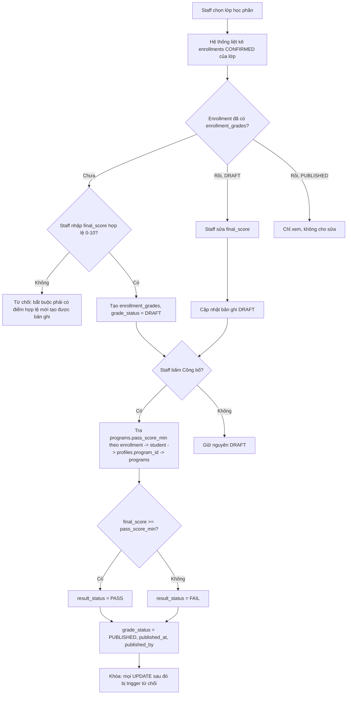
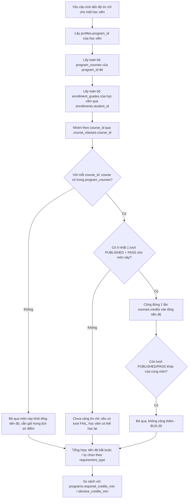

# Thiết kế Batch 3: Quản lý điểm và tiến độ học tập

> Tài liệu **thiết kế**, không phải PR code. Không migration nào (0000–0020) bị sửa. Không schema/RLS/RPC/API/UI nào được tạo hay sửa trong lượt này. Không seed, không chạy Supabase Cloud, không commit/push/deploy.

Nguồn tham chiếu đã đọc để viết tài liệu này:
- `docs/ACADEMIC_MANAGEMENT_EXPANSION_DESIGN.md` (toàn bộ, đặc biệt mục C.4/C.5, D BUS-16..26, E UC-09..21, H migration plan, L assumptions)
- `docs/BATCH_2_IMPLEMENTATION_REPORT.md` (toàn bộ)
- `supabase/migrations/0015_programs_and_cohorts.sql` .. `0020_batch2_rpc_revoke_anon.sql`
- Cấu trúc hiện tại của `enrollments`, `courses`, `course_classes`, `program_courses`, `profiles`, `programs`, `cohorts` (qua các migration trên)
- `apps/api/src/routes/students.ts`, `apps/api/src/schemas/students.ts` (quy ước route/schema Batch 2)

**Lưu ý quan trọng — khác biệt với dự thảo `enrollment_grades` ở `ACADEMIC_MANAGEMENT_EXPANSION_DESIGN.md` mục C.5/D (BUS-20..22):** tài liệu đó có một số quyết định (cột `attempt_no`, `course_id` riêng, `passed` boolean, không có vòng đời DRAFT/PUBLISHED) **khác** với các quyết định nghiệp vụ đã chốt cho Batch 3 trong lượt này (xem danh sách 12 điểm ở phần đầu yêu cầu, tóm tắt lại ở mục D). Tài liệu Batch 3 này là **bản chốt hiện hành**, thay thế mục C.5/D/E (các dòng liên quan đến điểm) và migration 0020/0021/0023/0024 trong bảng kế hoạch cũ. Không sửa file cũ — ghi nhận sự thay thế ở đây và sẽ đồng bộ lại file cũ khi Batch 3 thực sự triển khai.

### Lịch sử quyết định (chốt ngày 2026-08-02)

Năm điểm mở còn lại ở mục L (bản trước) đã được PO/staff chốt như sau — áp dụng xuyên suốt tài liệu này, không còn là giả định:

| # | Quyết định đã chốt | Thay thế cho |
|---|---|---|
| 1 | `programs.pass_score_min` là ngưỡng điểm đạt tối thiểu chính thức của chương trình, dùng trực tiếp khi công bố điểm (`final_score >= programs.pass_score_min` → PASS, ngược lại FAIL). Không thêm cột ngưỡng điểm mới, không đổi tên cột. | L.1.1 (cũ) |
| 2 | Học viên chỉ được xem điểm ở trạng thái `PUBLISHED`. `DRAFT` là dữ liệu nội bộ của Training Staff, không lộ ra `student_get_own_grades`/RLS SELECT của student dưới bất kỳ hình thức nào. Staff vẫn xem được cả DRAFT và PUBLISHED. | L.1.2 (cũ) |
| 3 | Giữ endpoint `staff_get_student_progress`/`GET /staff/students/:id/progress` trong Batch 3, dùng chung logic tính tiến độ với luồng của student, chỉ Training Staff được gọi. Không mở rộng thêm nghiệp vụ nào khác ngoài quyền xem tiến độ của một học viên. | L.1.4 (cũ) |
| 4 | Nếu một `course_class` đã có ít nhất một `enrollment_grades` ở `DRAFT` hoặc `PUBLISHED` (qua các `enrollment` của lớp đó), **chặn hủy lớp** (`cancel_course_class`) trong MVP — cần bổ sung check vào RPC `cancel_course_class` hiện có. Lý do: tránh mâu thuẫn giữa kết quả học tập đã có và một enrollment bị hủy. | L.1.3/L.2 (cũ) |
| 5 | Chỉ tạo `enrollment_grades` khi staff đã nhập `final_score` hợp lệ (0–10) ngay tại thời điểm tạo. Không có bản ghi điểm rỗng/khung trống. `DRAFT` nghĩa là "đã nhập điểm nhưng chưa công bố", không phải "chưa nhập điểm". | L.1.5 (cũ) |
| 6 | **Không được tự hủy `enrollment` (`cancel_own_enrollment`) nếu enrollment đó đã có `enrollment_grades`, bất kể `grade_status` là `DRAFT` hay `PUBLISHED`.** Rule phải được enforce ở tầng database/RPC (`cancel_own_enrollment`), UI chỉ là lớp hỗ trợ (khóa/ẩn nút), không phải lớp bảo vệ duy nhất. | Rủi ro L.2 (điểm thứ 3, bản trước) — nay đã chốt thành BUS-37 |

Các mục D, E, F, G, H, I, J, K bên dưới đã được cập nhật đồng bộ theo 6 quyết định này.

---

## A. Mục tiêu và phạm vi

### A.1 Mục tiêu
Cho phép Nhân viên đào tạo (TRAINING_STAFF) nhập điểm tổng kết cho các lượt đăng ký học phần đã CONFIRMED, công bố điểm theo vòng đời DRAFT → PUBLISHED, hệ thống tự xác định Đạt/Không đạt khi công bố, và cho học viên xem kết quả học tập + tiến độ tín chỉ tích lũy theo đúng chương trình đào tạo của mình.

### A.2 In-scope
1. Bảng điểm tổng kết 1–1 với `enrollments` (một enrollment CONFIRMED có tối đa một bản ghi điểm).
2. Vòng đời điểm: `DRAFT` (staff tạo/sửa tự do) → `PUBLISHED` (khóa, không sửa được trong MVP).
3. Tự động tính `PASS`/`FAIL` tại thời điểm công bố: `final_score >= programs.pass_score_min` (cột đã có sẵn từ migration 0015, đã chốt là "điểm đạt tối thiểu" của chương trình — xem Lịch sử quyết định #1) → `PASS`; ngược lại → `FAIL`. Không thêm cột ngưỡng điểm mới.
4. Tính tiến độ tín chỉ tích lũy: chỉ cộng tín chỉ cho các môn có trong `program_courses` của chương trình học viên, và chỉ cộng một lần cho mỗi môn dù học lại nhiều lần.
5. Học lại: học viên có thể đăng ký lại (enrollment mới) một môn Không đạt ở học kỳ sau; giữ lại toàn bộ lịch sử các lần học và các lần có điểm.
6. Trang/API cho staff nhập điểm theo lớp, công bố điểm; trang/API cho student xem kết quả và tiến độ tín chỉ.

### A.3 Out-of-scope (Batch 3, giữ nguyên theo yêu cầu đã chốt)
- GPA, điểm trung bình tích lũy, xếp loại tốt nghiệp.
- Quy đổi thang điểm 4 hoặc thang chữ (A/B/C...).
- Điểm thành phần (chuyên cần, giữa kỳ, cuối kỳ...) — chỉ một điểm tổng kết 0–10 cho mỗi lượt học.
- Tài khoản/vai trò giảng viên, luận văn, học phí, email/thông báo.
- Sửa điểm sau khi đã PUBLISHED (kể cả bởi staff) — nằm ngoài MVP này.
- Thay đổi logic đăng ký học phần hiện có (`register_for_class`) hay rule `academic_status = STUDYING` (giữ nguyên như đã chốt ở BUS-16, không đụng trong Batch 3).

---

## B. Actor và phân quyền

Không có actor mới — vẫn đúng 2 role nhị phân đã có: `STUDENT`, `TRAINING_STAFF`.

| Chức năng | Student | Training Staff |
|---|:---:|:---:|
| Tạo/sửa điểm DRAFT cho một enrollment CONFIRMED | ✗ | ✓ |
| Công bố điểm (DRAFT → PUBLISHED) | ✗ | ✓ |
| Sửa điểm đã PUBLISHED | ✗ | ✗ (không ai được sửa trong MVP) |
| Xem danh sách điểm của một lớp/môn (mọi học viên trong lớp) | ✗ | ✓ |
| Xem kết quả học tập của bản thân (chỉ điểm `PUBLISHED`; `DRAFT` là dữ liệu nội bộ staff, không lộ ra) | ✓ | — |
| Xem kết quả học tập của một học viên bất kỳ (cả DRAFT và PUBLISHED) | ✗ | ✓ |
| Xem tiến độ tín chỉ của bản thân | ✓ | — |
| Xem tiến độ tín chỉ của một học viên bất kỳ | ✗ | ✓ |

Không có permission per-object ngoài phân tách Student/Staff hiện có — dùng đúng mô hình RLS + `requireRole` như MVP và Batch 1/2.

---

## C. Thuật ngữ và trạng thái điểm

| Thuật ngữ | Định nghĩa |
|---|---|
| **Lượt học (attempt)** | Một `enrollment` CONFIRMED — mỗi lần học viên đăng ký và được xác nhận vào một lớp học phần của một môn, kể cả học lại, là một lượt học riêng biệt, có `enrollment_id` riêng. |
| **Điểm tổng kết (final_score)** | Một giá trị số 0–10 (một chữ số thập phân), gắn 1–1 với một `enrollment`. |
| **`grade_status` (trạng thái vòng đời điểm)** | `DRAFT` — staff tạo/sửa tự do, chưa có hiệu lực chính thức, chưa xác định Đạt/Không đạt. `PUBLISHED` — đã công bố, khóa, không sửa được nữa (MVP), đã có `result_status` xác định. |
| **`result_status` (kết quả Đạt/Không đạt)** | Chỉ có giá trị khi `grade_status = PUBLISHED`. `PASS` nếu `final_score >= programs.pass_score_min` của chương trình học viên tại thời điểm công bố; `FAIL` nếu ngược lại. `NULL`/không áp dụng khi còn `DRAFT`. |
| **Tín chỉ tiến độ (progress credit)** | Tín chỉ được cộng vào tổng tiến độ tích lũy của học viên. Chỉ tính khi: (a) môn đó có trong `program_courses` của chương trình học viên, và (b) có **ít nhất một** lượt học (enrollment) của môn đó có điểm `PUBLISHED` + `result_status = PASS`. Chỉ cộng **một lần** cho mỗi môn dù có nhiều lượt học đạt. |
| **"Điểm được lưu" vs "tín chỉ được tính vào tiến độ"** | Hai khái niệm tách biệt hoàn toàn (xem D.4). Một điểm luôn được lưu và giữ lịch sử, kể cả khi môn đó không thuộc `program_courses` của chương trình học viên hoặc học viên không đạt — nhưng chỉ khi thỏa cả hai điều kiện trên thì tín chỉ mới được cộng vào tiến độ. |

---

## D. Data model đề xuất

### D.1 Bảng mới: `enrollment_grades`

| Cột | Kiểu | Ghi chú |
|---|---|---|
| `id` | uuid PK | |
| `enrollment_id` | uuid FK → `enrollments`, **NOT NULL, UNIQUE** | quan hệ 1–1 bắt buộc; một `enrollment` có tối đa một bản ghi điểm; không cho tạo điểm nếu `enrollment_id` không tồn tại hoặc không ở trạng thái `CONFIRMED` tại thời điểm tạo (BUS-27) |
| `final_score` | numeric(3,1) NOT NULL, check 0–10 | điểm tổng kết; **bắt buộc có giá trị hợp lệ ngay tại thời điểm tạo bản ghi** — không có bước "tạo khung điểm rỗng" rồi nhập sau; `DRAFT` nghĩa là "đã nhập điểm nhưng chưa công bố", không phải "chưa nhập điểm" (Lịch sử quyết định #5) |
| `grade_status` | text, check in (`DRAFT`, `PUBLISHED`), default `DRAFT` | vòng đời điểm (BUS-29) |
| `result_status` | text, check in (`PASS`, `FAIL`), nullable | chỉ được set khi công bố; NULL khi còn DRAFT; check ràng buộc: `result_status IS NOT NULL ⟺ grade_status = 'PUBLISHED'` |
| `published_at` | timestamptz, nullable | thời điểm công bố; NULL khi còn DRAFT |
| `published_by` | uuid FK → `profiles` (staff), nullable | ai công bố; NULL khi còn DRAFT |
| `created_at` | timestamptz | |
| `updated_at` | timestamptz | trigger `set_updated_at` (mẫu có sẵn từ MVP); **chặn UPDATE nếu `grade_status = 'PUBLISHED'` ở trigger riêng** (BUS-31) |

**Không có cột `attempt_no`:** khác với dự thảo cũ ở `ACADEMIC_MANAGEMENT_EXPANSION_DESIGN.md` C.5. Vì quan hệ là 1–1 với `enrollment_id`, thứ tự "lần học thứ mấy" đã được suy ra tự nhiên từ `enrollments.created_at` (hoặc từ `registration_periods` mà `course_class` của `enrollment` đó thuộc về) khi cần hiển thị — không cần lưu counter riêng, tránh dữ liệu trùng lặp có thể lệch nhau.

### D.2 Vì sao không lưu `program_id`/`course_id`/`student_id` dư thừa trong `enrollment_grades`

Theo nguyên tắc đã có ở `supabase/README.md` và được nhắc lại xuyên suốt các batch trước ("không lưu cột trùng lặp có thể suy ra từ quan hệ"):

- `enrollment_id` đã là khóa ngoại duy nhất và bắt buộc trỏ về đúng một `enrollments` row. Từ đó suy ra được toàn bộ ngữ cảnh cần thiết (xem D.3).
- Lưu thêm `student_id`/`course_id`/`program_id` trực tiếp trên `enrollment_grades` tạo ra **hai nguồn sự thật** cho cùng một dữ kiện: nếu `enrollment.student_id` và `enrollment_grades.student_id` có thể lệch nhau (do lỗi nhập liệu, do cập nhật một bên mà quên bên kia), hệ thống sẽ không có cách nào tự phát hiện mâu thuẫn ngoài việc thêm ràng buộc đồng bộ tốn kém (trigger so khớp hai bảng ở mọi UPDATE). Bỏ hẳn các cột này loại trừ khả năng lệch dữ liệu, đổi lại chỉ là một JOIN (rẻ, có index) mỗi khi cần truy vấn.
- `program_id` của học viên còn có thể **thay đổi lý thuyết** (dù bị khóa bởi `profiles_academic_guard` sau khi có `enrollments`/`enrollment_grades`/`theses` — xem BUS-26 ở tài liệu mở rộng) — nếu lưu cứng `program_id` tại thời điểm chấm điểm vào `enrollment_grades`, sẽ không rõ đây là "chương trình tại thời điểm học" hay "chương trình hiện tại", gây nhập nhằng nghiệp vụ. Không lưu cột này buộc mọi tính toán tiến độ tín chỉ luôn dùng **chương trình hiện tại** của học viên (nhất quán, dễ giải thích, đúng với thực tế vì BUS-26 đã khóa chương trình ngay khi có điểm).

### D.3 Truy ngược quan hệ

```
enrollment_grades.enrollment_id
  → enrollments.course_class_id → course_classes.course_id → courses (tên môn, số tín chỉ)
  → enrollments.course_class_id → course_classes.registration_period_id → registration_periods (học kỳ/đợt)
  → enrollments.student_id → profiles (học viên)
      → profiles.program_id → programs (pass_score_min, required/elective_credits_min)
      → profiles.program_id + courses.id → program_courses (môn có trong khung chương trình hay không, REQUIRED/ELECTIVE)
```

Tất cả truy vấn hiển thị (bảng điểm lớp, kết quả học tập, tiến độ tín chỉ) đều đi qua chuỗi JOIN này — không có đường tắt lưu sẵn. Vì `enrollment_id` là NOT NULL + UNIQUE, mỗi JOIN đều xác định (không nhân bản dòng).

### D.4 Tách bạch "điểm được lưu" và "tín chỉ được tính vào tiến độ"

- **Điểm được lưu:** mọi `enrollment_grades` hợp lệ (gắn với một `enrollment` CONFIRMED) được lưu và giữ vĩnh viễn, bất kể môn đó có nằm trong `program_courses` của chương trình học viên hay không, và bất kể `result_status` là gì (luật đã chốt #7, #9).
- **Tín chỉ được tính vào tiến độ:** chỉ tính khi thỏa đồng thời (a) môn nằm trong `program_courses` của chương trình học viên hiện tại, (b) tồn tại ít nhất một `enrollment_grades` của môn đó với `grade_status = PUBLISHED` và `result_status = PASS`. Tiến độ tín chỉ **không phải là một cột lưu sẵn** — luôn tính real-time bằng RPC/view tại thời điểm truy vấn (nhất quán với cách `enrollment_grades` không lưu counter, và với cách MVP không lưu số ghế còn lại của `course_classes`).
- Hệ quả: một môn ngoài khung chương trình (không có trong `program_courses`) vẫn có bảng điểm/lịch sử đầy đủ trên trang "Kết quả học tập", nhưng không xuất hiện trong phần "Tiến độ tín chỉ" hoặc xuất hiện với ghi chú rõ "không tính vào tiến độ chương trình hiện tại" (xem J.2 UI empty/edge state).

### D.5 ERD rút gọn

```
programs 1───* program_courses *───1 courses
programs 1───* profiles (program_id)
profiles 1───* enrollments (MVP) 1───0..1 enrollment_grades
enrollments *───1 course_classes *───1 courses
course_classes *───1 registration_periods
```

---

## E. Business Rules mới (tiếp nối BUS-26)

| Code | Nội dung |
|---|---|
| **BUS-27** | Chỉ được tạo bản ghi `enrollment_grades` cho một `enrollment` đang ở trạng thái `CONFIRMED` tại thời điểm tạo, **và chỉ khi staff đã cung cấp `final_score` hợp lệ (0–10) ngay tại thời điểm tạo** (Lịch sử quyết định #5) — không có bước tạo dòng điểm rỗng. Nếu enrollment không tồn tại hoặc không CONFIRMED (REJECTED/CANCELLED_BY_STUDENT/CANCELLED_BY_SCHOOL), hoặc `final_score` không hợp lệ/thiếu, RPC nhập điểm từ chối. Việc `enrollment` đổi trạng thái *sau khi* đã có điểm không tự động xóa/khóa điểm (xem BUS-36 về việc chặn hủy lớp khi đã có điểm; xem BUS-37 về việc chặn học viên tự hủy enrollment của chính mình khi đã có điểm). |
| **BUS-28** | Một `enrollment` có tối đa một bản ghi `enrollment_grades` (ràng buộc UNIQUE trên `enrollment_id`). Nhập điểm lần hai cho cùng một `enrollment` là **sửa** bản ghi DRAFT hiện có, không phải tạo dòng mới. |
| **BUS-29** | `final_score` là bắt buộc (NOT NULL) ngay từ khi tạo bản ghi, phải nằm trong khoảng [0, 10] với tối đa một chữ số thập phân. Áp dụng ở cả `DRAFT` và `PUBLISHED`. Không tồn tại bản ghi `enrollment_grades` nào có `final_score` rỗng (Lịch sử quyết định #5). |
| **BUS-30** | Điểm có đúng hai trạng thái vòng đời: `DRAFT` → `PUBLISHED`, một chiều, không có chiều ngược trong MVP (không "hủy công bố"/"revert to draft"). `DRAFT` = "staff đã nhập điểm, chưa công bố" — không phải khung điểm trống. Staff được sửa tự do `final_score` của bản ghi ở trạng thái `DRAFT` (nhiều lần trước khi công bố), nhưng không thể tạo một bản ghi DRAFT không có điểm. |
| **BUS-31** | Ngay khi `grade_status = PUBLISHED`, bản ghi bị khóa: mọi UPDATE (kể cả bởi staff, kể cả qua RPC/API/RLS) đối với `final_score`, `grade_status`, `result_status` bị từ chối ở tầng DB (trigger), không chỉ tầng UI/API. Không có exception, không có "sửa khẩn cấp" trong phạm vi Batch 3. |
| **BUS-32** | Khi công bố (chuyển `DRAFT` → `PUBLISHED`), `final_score` luôn đã có sẵn (bắt buộc từ lúc tạo theo BUS-27/29) nên RPC công bố không cần kiểm tra "còn trống" — chỉ cần kiểm tra bản ghi đang ở `DRAFT`. Hệ thống tự tính `result_status`: `final_score >= programs.pass_score_min` (ngưỡng điểm đạt tối thiểu chính thức của chương trình học viên — Lịch sử quyết định #1, tra qua chuỗi `enrollment → student → profiles.program_id → programs`) → `PASS`; ngược lại → `FAIL`. Không cho nhập tay `result_status`. Không thêm cột ngưỡng điểm mới. |
| **BUS-33** | Chỉ môn học có mặt trong `program_courses` của chương trình học viên (`profiles.program_id`) tại thời điểm truy vấn tiến độ mới được cộng vào tổng tín chỉ tiến độ. Môn ngoài khung chương trình vẫn được lưu điểm/lịch sử bình thường (BUS-27/28) nhưng không xuất hiện trong phép tính tiến độ tín chỉ. |
| **BUS-34** | Học viên có một lượt học `PUBLISHED` + `result_status = FAIL` cho một môn được phép đăng ký lại môn đó ở một đợt đăng ký (học kỳ) sau — tạo một `enrollment` CONFIRMED mới, độc lập, dẫn tới một `enrollment_grades` mới (1–1 với enrollment mới). Không xóa/sửa `enrollment` hay `enrollment_grades` của lượt học trước (append-only, nhất quán với `enrollment_history`/BUS-09). Việc cho phép đăng ký lại tuân theo đúng logic đăng ký MVP hiện có (một CONFIRMED tại một thời điểm cho cùng course+registration_period) — Batch 3 không sửa logic đăng ký. |
| **BUS-35** | Tín chỉ của một môn chỉ được cộng vào tổng tiến độ tín chỉ của học viên **đúng một lần**, ngay khi tồn tại **ít nhất một** lượt học của môn đó có `PUBLISHED` + `PASS`, bất kể học viên có bao nhiêu lượt học khác (kể cả các lượt sau đó, dù đạt hay không đạt) cho cùng môn. Không cộng dồn theo số lần đạt. |
| **BUS-36** | Nếu một `course_class` có ít nhất một `enrollment` với `enrollment_grades` ở `DRAFT` hoặc `PUBLISHED`, **không được hủy lớp** đó (`cancel_course_class`) — RPC phải từ chối với lỗi nghiệp vụ rõ ràng. Lý do: tránh mâu thuẫn giữa kết quả học tập đã ghi nhận và một enrollment/lớp bị hủy (Lịch sử quyết định #4). Đây là **thay đổi bắt buộc** vào RPC `cancel_course_class` hiện có (Batch 1/2) — cần bổ sung check tồn tại điểm trước khi cho phép hủy; không phải chỉ ràng buộc DB mới. |
| **BUS-37** | Học viên **không được tự hủy `enrollment` của chính mình** (`cancel_own_enrollment`) nếu enrollment đó đã có bản ghi `enrollment_grades`, **bất kể `grade_status` là `DRAFT` hay `PUBLISHED`**. RPC `cancel_own_enrollment` phải từ chối với lỗi nghiệp vụ rõ ràng nếu tồn tại `enrollment_grades` gắn với `enrollment_id` đó. Lý do: cho phép tự hủy enrollment đã có điểm sẽ khiến enrollment chuyển sang trạng thái hủy trong khi điểm vẫn còn tồn tại, mâu thuẫn với nguyên tắc chỉ nhập điểm cho enrollment `CONFIRMED` (BUS-27) và làm sai lệch tính toán tiến độ tín chỉ (D.4/BUS-33..35, vì `enrollment_grades` vẫn trỏ về một `enrollment` không còn `CONFIRMED`). Rule phải được enforce ở **tầng database/RPC** — UI (nút "Hủy" bị khóa/ẩn) chỉ là lớp hỗ trợ, không phải lớp bảo vệ duy nhất; gọi trực tiếp RPC/API vẫn phải bị chặn. Đây là **thay đổi bắt buộc** vào RPC `cancel_own_enrollment` hiện có (MVP) — cần bổ sung check tồn tại `enrollment_grades` (không phân biệt `DRAFT`/`PUBLISHED`) trước khi cho phép hủy; không thay đổi các điều kiện hủy khác đã có (thời hạn đợt đăng ký, trạng thái enrollment hiện tại, v.v.). |

---

## F. Use cases mới (tiếp nối UC-21)

| Code | Tên | Actor chính |
|---|---|---|
| UC-22 | Nhập/sửa điểm DRAFT cho một lượt học (enrollment CONFIRMED) | Training staff |
| UC-23 | Công bố điểm (DRAFT → PUBLISHED), hệ thống tự tính PASS/FAIL | Training staff, System |
| UC-24 | Xem danh sách điểm của một lớp học phần (tất cả học viên trong lớp) | Training staff |
| UC-25 | Xem kết quả học tập của bản thân (toàn bộ lịch sử, kể cả học lại) | Student |
| UC-26 | Xem tiến độ tín chỉ của bản thân (tổng đã đạt / tối thiểu cần theo chương trình) | Student |
| UC-27 | Tự hủy một lượt đăng ký (`enrollment`) của chính mình, hệ thống từ chối nếu lượt đó đã có điểm | Student, System |

---

## G. User stories & acceptance criteria (Gherkin)

**US-21** (UC-22, BUS-27/28/29/30) — *Là nhân viên đào tạo, tôi muốn nhập hoặc sửa điểm nháp cho một học viên trong lớp mình phụ trách.*

```gherkin
Feature: Nhập điểm nháp

  Scenario: Nhập điểm cho enrollment CONFIRMED chưa có điểm
    Given một enrollment đang ở trạng thái CONFIRMED và chưa có bản ghi enrollment_grades
    When staff nhập final_score hợp lệ (0-10) và lưu
    Then hệ thống tạo một bản ghi enrollment_grades mới với grade_status = DRAFT
    And result_status là NULL

  Scenario: Từ chối tạo dòng điểm không có final_score
    Given một enrollment CONFIRMED chưa có bản ghi enrollment_grades
    When staff cố tạo bản ghi điểm mà không cung cấp final_score
    Then hệ thống từ chối, không tạo bản ghi rỗng (không có khung điểm trống trong MVP)

  Scenario: Từ chối nhập điểm cho enrollment không CONFIRMED
    Given một enrollment đang ở trạng thái CANCELLED_BY_STUDENT
    When staff cố nhập điểm cho enrollment đó
    Then hệ thống từ chối với thông báo enrollment không ở trạng thái hợp lệ để nhập điểm

  Scenario: Từ chối điểm ngoài khoảng hợp lệ
    Given một enrollment CONFIRMED chưa có điểm
    When staff nhập final_score = 10.5
    Then hệ thống từ chối với thông báo điểm phải trong khoảng 0-10

  Scenario: Sửa điểm DRAFT nhiều lần trước khi công bố
    Given một enrollment_grades đang ở grade_status = DRAFT
    When staff sửa final_score sang một giá trị hợp lệ khác
    Then bản ghi được cập nhật, vẫn giữ grade_status = DRAFT

  Scenario: Không cho sửa điểm đã PUBLISHED
    Given một enrollment_grades đang ở grade_status = PUBLISHED
    When staff cố sửa final_score
    Then hệ thống từ chối ở tầng DB, không phụ thuộc vào việc UI có cho phép hay không
```

**US-22** (UC-23, BUS-32) — *Là nhân viên đào tạo, tôi muốn công bố điểm để hệ thống tự xác định Đạt/Không đạt và khóa điểm lại.*

```gherkin
Feature: Công bố điểm

  Scenario: Công bố điểm hợp lệ
    Given một enrollment_grades ở grade_status = DRAFT với final_score = 7.5
    And chương trình học viên có pass_score_min = 5.0
    When staff công bố điểm
    Then grade_status chuyển thành PUBLISHED
    And result_status được hệ thống tự tính là PASS
    And published_at, published_by được ghi nhận

  Scenario: Kết quả FAIL khi dưới ngưỡng
    Given final_score = 4.0 và pass_score_min = 5.0
    When staff công bố điểm
    Then result_status được tính là FAIL
```

*(Không còn scenario "công bố khi chưa có điểm" — theo Lịch sử quyết định #5, `final_score` luôn bắt buộc ngay từ khi tạo bản ghi, nên trạng thái DRAFT không có điểm không thể tồn tại; xem K.1 cho test constraint tương ứng.)*

**US-23** (UC-25/UC-26, BUS-33/34/35) — *Là học viên, tôi muốn xem toàn bộ lịch sử điểm của mình và biết chính xác tín chỉ nào đã được tính vào tiến độ.*

```gherkin
Feature: Xem kết quả và tiến độ tín chỉ

  Scenario: Học viên chỉ thấy điểm đã công bố
    Given học viên có một enrollment_grades ở DRAFT (final_score = 6.0, chưa công bố) và một enrollment_grades khác đã PUBLISHED
    When học viên gọi student_get_own_grades / mở trang "Kết quả học tập"
    Then chỉ dòng PUBLISHED được trả về
    And dòng DRAFT không xuất hiện dưới bất kỳ hình thức nào (không lộ cả final_score lẫn sự tồn tại của bản ghi)

  Scenario: Staff vẫn thấy cả DRAFT và PUBLISHED
    Given cùng dữ liệu như trên
    When staff xem "Kết quả học tập" của học viên đó (GET /staff/students/:id/grades)
    Then cả hai dòng DRAFT và PUBLISHED đều hiển thị, có phân biệt trạng thái rõ ràng

  Scenario: Xem lịch sử học lại
    Given học viên có hai enrollment cho cùng một môn: lần 1 PUBLISHED/FAIL, lần 2 PUBLISHED/PASS
    When học viên mở trang "Kết quả học tập"
    Then cả hai lượt học đều hiển thị với đầy đủ điểm và kết quả
    And chỉ lượt đạt được đánh dấu là "đã tính tín chỉ"

  Scenario: Môn ngoài khung chương trình không tính tiến độ
    Given học viên có điểm PUBLISHED/PASS cho một môn không có trong program_courses của chương trình mình
    When học viên xem trang "Tiến độ tín chỉ"
    Then tổng tín chỉ tiến độ không bao gồm môn đó
    And trang "Kết quả học tập" vẫn hiển thị điểm của môn đó kèm ghi chú không tính vào tiến độ

  Scenario: Không cộng trùng tín chỉ khi học lại sau khi đã đạt
    Given học viên đã có một lượt PUBLISHED/PASS cho môn X (đã cộng tín chỉ)
    And học viên có thêm một lượt học khác (enrollment mới) cho môn X đã PUBLISHED/PASS
    When hệ thống tính tổng tiến độ tín chỉ
    Then tín chỉ môn X chỉ được cộng đúng một lần trong tổng
```

**US-24** (BUS-36) — *Là nhân viên đào tạo, tôi không được phép hủy một lớp học phần đã có kết quả học tập, để tránh dữ liệu điểm mồ côi/mâu thuẫn.*

```gherkin
Feature: Chặn hủy lớp học phần đã có điểm

  Scenario: Từ chối hủy lớp khi có ít nhất một điểm DRAFT
    Given một course_class có một enrollment với enrollment_grades ở grade_status = DRAFT
    When staff gọi cancel_course_class cho lớp đó
    Then hệ thống từ chối với thông báo lớp đã có điểm, không thể hủy

  Scenario: Từ chối hủy lớp khi có ít nhất một điểm PUBLISHED
    Given một course_class có một enrollment với enrollment_grades ở grade_status = PUBLISHED
    When staff gọi cancel_course_class cho lớp đó
    Then hệ thống từ chối với thông báo lớp đã có điểm, không thể hủy

  Scenario: Vẫn cho phép hủy lớp chưa có điểm nào
    Given một course_class có enrollment CONFIRMED nhưng chưa enrollment nào có enrollment_grades
    When staff gọi cancel_course_class cho lớp đó
    Then hệ thống xử lý hủy lớp bình thường như trước Batch 3 (hành vi BUS-01..15 không đổi)
```

**US-25** (UC-27, BUS-37) — *Là học viên, tôi không được phép tự hủy một lượt đăng ký đã có điểm, để tránh dữ liệu điểm mồ côi/mâu thuẫn tiến độ.*

```gherkin
Feature: Chặn tự hủy enrollment đã có điểm

  Scenario: Tự hủy thành công khi enrollment CONFIRMED chưa có điểm
    Given một enrollment CONFIRMED của học viên chưa có bản ghi enrollment_grades
    When học viên gọi cancel_own_enrollment cho enrollment đó
    Then hệ thống xử lý hủy bình thường như trước Batch 3 (hoàn chỗ, giảm tín chỉ đang đăng ký như Batch MVP)

  Scenario: Từ chối tự hủy khi enrollment đã có điểm DRAFT
    Given một enrollment CONFIRMED của học viên đã có enrollment_grades ở grade_status = DRAFT
    When học viên gọi cancel_own_enrollment cho enrollment đó
    Then hệ thống từ chối với thông báo lượt đăng ký đã có điểm, không thể tự hủy

  Scenario: Từ chối tự hủy khi enrollment đã có điểm PUBLISHED
    Given một enrollment CONFIRMED của học viên đã có enrollment_grades ở grade_status = PUBLISHED
    When học viên gọi cancel_own_enrollment cho enrollment đó
    Then hệ thống từ chối với thông báo lượt đăng ký đã có điểm, không thể tự hủy

  Scenario: UI không phải lớp bảo vệ duy nhất
    Given một enrollment đã có enrollment_grades (DRAFT hoặc PUBLISHED)
    When học viên gọi thẳng RPC/API cancel_own_enrollment (bỏ qua UI, ví dụ qua curl/Postman với JWT hợp lệ của chính mình)
    Then hệ thống vẫn từ chối ở tầng RPC/database, không phụ thuộc vào việc nút "Hủy" trên UI có bị khóa/ẩn hay không
```

---

## H. Business flows (Mermaid)

### H.1 Nhập và công bố điểm



*(final_score luôn có sẵn khi bản ghi tồn tại — BUS-27/29 — nên nhánh công bố không còn bước kiểm tra "điểm trống".)*

### H.2 Tính tiến độ tín chỉ (bao gồm học lại)



### H.3 Tự hủy enrollment (chặn nếu đã có điểm)

```mermaid
flowchart TD
    A[Học viên gọi cancel_own_enrollment cho enrollment của chính mình] --> B{Enrollment ở trạng thái hủy được theo rule MVP hiện có? (thời hạn đợt, CONFIRMED...)}
    B -- Không --> B1[Từ chối như hành vi MVP hiện có, không đổi]
    B -- Có --> C{Enrollment đã có bản ghi enrollment_grades? (DRAFT hoặc PUBLISHED, không phân biệt)}
    C -- Có --> D[Từ chối: lượt đăng ký đã có điểm, không thể tự hủy - BUS-37]
    C -- Chưa --> E[Xử lý hủy bình thường: chuyển trạng thái, hoàn chỗ, giảm tín chỉ đang đăng ký như Batch MVP]
```

*(Check BUS-37 nằm ngay trong RPC `cancel_own_enrollment`, thực thi bất kể lời gọi đến từ UI hay trực tiếp RPC/API — UI chỉ ẩn/khóa nút "Hủy" để hỗ trợ trải nghiệm, không thay thế check này.)*

---

## I. Kế hoạch migration dự kiến (từ 0021, không viết SQL)

| # | File dự kiến | Nội dung |
|---|---|---|
| 0021 | `0021_enrollment_grades.sql` | Tạo bảng `enrollment_grades` (cột theo mục D.1): `enrollment_id` NOT NULL UNIQUE FK → `enrollments`, `final_score` numeric(3,1) **NOT NULL** check 0–10 (Lịch sử quyết định #5 — không có khung điểm rỗng), `grade_status` check DRAFT/PUBLISHED default DRAFT, `result_status` check PASS/FAIL nullable với ràng buộc đồng bộ với `grade_status`, `published_at`/`published_by` nullable, `created_at`/`updated_at`; trigger `set_updated_at`; trigger riêng chặn UPDATE khi `grade_status = PUBLISHED` (BUS-31) — chặn cả thay đổi `final_score` lẫn cố tình đổi ngược `grade_status`. |
| 0022 | `0022_rls_enrollment_grades.sql` | Bật RLS cho `enrollment_grades`, ship trong batch tạo bảng (đúng convention đã áp dụng từ Batch 1 — không dồn về migration RLS cuối). Policy: Training Staff SELECT/INSERT/UPDATE toàn bộ (cả DRAFT và PUBLISHED; UPDATE thực chất chỉ có hiệu lực khi còn DRAFT vì trigger 0021 đã khóa PUBLISHED ở tầng bảng); Student chỉ SELECT các dòng mà `enrollment_id` thuộc về `enrollment` có `student_id = auth.uid()` **VÀ `grade_status = 'PUBLISHED'`** (Lịch sử quyết định #2 — DRAFT là dữ liệu nội bộ staff, policy SELECT của student phải lọc thẳng ở điều kiện RLS, không dựa vào RPC/API ẩn cột). Không có policy DELETE cho ai (không hard delete, nhất quán MVP). |
| 0023 | `0023_rpc_record_and_publish_grade.sql` | Hai RPC SECURITY DEFINER theo đúng convention Batch 1/2 (`search_path = pg_catalog, public`, `revoke all from public`, `grant execute to authenticated`, lỗi nghiệp vụ trả `jsonb {success:false, reason}`, lỗi phân quyền `raise exception`): `staff_create_draft_grade(p_enrollment_id, p_final_score)` (tạo bản ghi DRAFT mới với `final_score` bắt buộc hợp lệ ngay trong lời gọi, từ chối nếu enrollment không CONFIRMED hoặc `final_score` thiếu/ngoài [0,10] — BUS-27/28/29), `staff_update_draft_grade(p_enrollment_id, p_final_score)` (sửa `final_score` khi còn DRAFT, từ chối nếu đã PUBLISHED — BUS-30) và `staff_publish_grade(p_enrollment_id)` (tính `result_status` theo `programs.pass_score_min`, set `PUBLISHED`, `published_at`, `published_by` — BUS-32). |
| 0024 | `0024_rpc_staff_list_class_grades.sql` | RPC `staff_list_class_grades(p_course_class_id)` — trả danh sách học viên CONFIRMED của lớp kèm trạng thái điểm hiện tại (phục vụ UC-24, trang nhập điểm theo lớp). |
| 0025 | `0025_rpc_student_grades_and_progress.sql` | Ba RPC dùng chung một hàm tính tiến độ nội bộ (tránh lệch logic giữa student/staff — Lịch sử quyết định #3): `student_get_own_grades()` (chỉ trả các dòng `PUBLISHED` của chính người gọi, lọc bởi cả RLS 0022 lẫn điều kiện trong RPC — phòng thủ hai lớp — UC-25), `student_get_own_progress()` (tổng tín chỉ bắt buộc/tự chọn đã đạt theo BUS-33/34/35, so với `programs.required_credits_min`/`elective_credits_min` của chương trình hiện tại — UC-26), và `staff_get_student_progress(p_student_id)` (chỉ Training Staff gọi được, tái sử dụng đúng logic tính tiến độ của `student_get_own_progress` cho một `p_student_id` bất kỳ do staff truyền vào — không có nghiệp vụ nào khác ngoài quyền xem, Lịch sử quyết định #3). |
| 0026 | `0026_rpc_cancel_course_class_block_if_graded.sql` | **Sửa RPC `cancel_course_class` đã có từ Batch 1/2** (không tạo bảng/cột mới) để bổ sung check: nếu tồn tại bất kỳ `enrollment` nào của lớp có `enrollment_grades` (DRAFT hoặc PUBLISHED), từ chối hủy với lỗi nghiệp vụ rõ ràng (BUS-36). Đây là thay đổi logic duy nhất trong Batch 3 đụng tới luồng đăng ký hiện có — phạm vi hẹp, chỉ thêm một điều kiện chặn, không đổi hành vi hủy lớp khi chưa có điểm. |
| 0027 | `0027_rpc_cancel_own_enrollment_block_if_graded.sql` | **Sửa RPC `cancel_own_enrollment` đã có từ Batch MVP** (không tạo bảng/cột mới) để bổ sung check: nếu `enrollment_id` được truyền vào đã có bản ghi `enrollment_grades` (DRAFT hoặc PUBLISHED, không phân biệt), từ chối hủy với lỗi nghiệp vụ rõ ràng bằng tiếng Việt (BUS-37). Đây là thay đổi logic thứ hai trong Batch 3 đụng tới luồng đăng ký hiện có (sau 0026) — phạm vi hẹp, chỉ thêm một điều kiện chặn ở đầu RPC, không đổi các điều kiện hủy khác đã có (thời hạn đợt đăng ký, trạng thái enrollment hiện tại, hoàn chỗ/giảm tín chỉ khi hủy hợp lệ). Giải quyết dứt điểm rủi ro đã ghi nhận ở L.2 (bản trước). |

**Nguyên tắc kế thừa:** không sửa 0000–0020 (bảng/RLS/RPC hiện có được giữ nguyên cấu trúc); mỗi migration một mối quan tâm; RLS ship cùng batch với bảng nó bảo vệ (đã là convention từ Batch 1); RPC business-logic tách khỏi RPC read-only theo đúng pattern `staff_*`/`student_*` đã dùng ở 0019; 0026 và 0027 là ngoại lệ có chủ đích — sửa hành vi của RPC cũ (`cancel_course_class`, `cancel_own_enrollment`) theo đúng quyết định #4 và #6, không sửa cấu trúc bảng cũ.

**Không ảnh hưởng dữ liệu MVP hiện có:** `enrollment_grades` là bảng mới, chỉ có FK trỏ *vào* `enrollments`/`profiles`, không có FK ngược từ `enrollments` vào `enrollment_grades` — không cần backfill, không đổi cấu trúc bảng cũ. 0026 và 0027 thay đổi **hành vi** (không phải cấu trúc) của `cancel_course_class`/`cancel_own_enrollment`: các lớp/enrollment chưa có điểm tiếp tục hủy được y hệt trước Batch 3; chỉ các lớp/enrollment đã có điểm mới bị chặn thêm.

---

## J. API/UI plan

### J.1 API endpoints dự kiến

**Staff** (`/api/staff/*`, `requireRole('TRAINING_STAFF')`):
- `GET /staff/course-classes/:id/grades` → RPC `staff_list_class_grades` (UC-24)
- `POST /staff/enrollments/:enrollmentId/grade` → RPC `staff_create_draft_grade` (bắt buộc kèm `final_score` hợp lệ trong body — UC-22)
- `PATCH /staff/enrollments/:enrollmentId/grade` → RPC `staff_update_draft_grade` (chỉ khi còn DRAFT — UC-22)
- `POST /staff/enrollments/:enrollmentId/grade/publish` → RPC `staff_publish_grade` (UC-23)
- `GET /staff/students/:id/grades` → lịch sử điểm đầy đủ của một học viên, cả DRAFT lẫn PUBLISHED (phục vụ đối chiếu — staff không bị giới hạn PUBLISHED-only như student)
- `GET /staff/students/:id/progress` → RPC `staff_get_student_progress` (UC-24 mở rộng đã chốt — dùng chung logic tính tiến độ với `student_get_own_progress`, chỉ TRAINING_STAFF gọi được, không có nghiệp vụ ghi nào kèm theo)

**Student** (`/api/student/*`, `requireRole('STUDENT')`):
- `GET /student/grades` → RPC `student_get_own_grades` — **chỉ trả các dòng `PUBLISHED`**, không có tham số/flag nào để lộ DRAFT (UC-25)
- `GET /student/progress` → RPC `student_get_own_progress` (UC-26)
- `POST /student/enrollments/:enrollmentId/cancel` (endpoint hiện có từ Batch MVP) → RPC `cancel_own_enrollment` — **cập nhật ở migration 0027** để từ chối nếu `enrollment_id` đã có `enrollment_grades` (DRAFT hoặc PUBLISHED), trả lỗi nghiệp vụ rõ ràng (400 + `reason` tiếng Việt), không phải 500 (UC-27, BUS-37). Endpoint và route không đổi tên/không đổi hợp đồng ngoài phần lỗi mới này.

Không có endpoint DELETE cho `enrollment_grades` (không hard delete). Không có endpoint PATCH khả dụng sau khi PUBLISHED — gọi `staff_update_draft_grade` trên một bản ghi PUBLISHED phải trả lỗi nghiệp vụ rõ ràng từ RPC, không phải lỗi 500 chung chung. `POST .../grade` không bao giờ tạo bản ghi thiếu `final_score` — thiếu hoặc sai khoảng [0,10] đều bị RPC từ chối trước khi chạm DB (BUS-27/29).

### J.2 Trang Staff

- **"Nhập điểm lớp học phần"** (ví dụ `/staff/course-classes/:id/grades`) — danh sách học viên CONFIRMED trong lớp, mỗi dòng: mã học viên, họ tên, ô nhập điểm (bắt buộc điền giá trị hợp lệ trước khi "Lưu nháp" lần đầu — không có nút "tạo dòng trống"; sau khi đã có DRAFT thì có thể sửa), trạng thái (Chưa có điểm / Nháp / Đã công bố), nút "Lưu nháp" theo dòng hoặc theo lô, nút "Công bố" (yêu cầu xác nhận, vì không thể hoàn tác — cảnh báo rõ ràng trên UI trước khi gọi RPC).
- **Chi tiết học viên (mở rộng `StaffStudentDetail.tsx` đã có ở Batch 2)** — thêm tab/section "Kết quả học tập" (lịch sử điểm, cả DRAFT và PUBLISHED, có nhãn phân biệt) và "Tiến độ tín chỉ" (gọi `staff_get_student_progress`, đọc-only, dùng để tham khảo khi staff xét các quyết định khác — không có action ghi trên trang này ngoài link tới trang nhập điểm theo lớp).
- **Trang "Danh sách lớp học phần" / hủy lớp** — nút "Hủy lớp" bị disable kèm tooltip giải thích ("Lớp đã có điểm, không thể hủy") nếu lớp đã có bất kỳ `enrollment_grades` nào (BUS-36); nếu staff vẫn cố gọi API trực tiếp, RPC `cancel_course_class` (đã sửa ở migration 0026) từ chối ở tầng server.

### J.3 Trang Student

- **"Kết quả học tập"** — chỉ hiển thị các lượt học đã có điểm `PUBLISHED` (Lịch sử quyết định #2 — DRAFT không hiển thị dưới bất kỳ hình thức nào, kể cả nhãn "đang chấm"), bảng điểm theo môn, mỗi môn có thể có nhiều dòng (nhiều lượt học), mỗi dòng hiển thị: mã lớp/học kỳ, điểm, kết quả (Đạt / Không đạt), có đánh dấu rõ dòng nào "đã tính tín chỉ tiến độ" và dòng nào thuộc môn ngoài khung chương trình (ghi chú "không tính vào tiến độ chương trình hiện tại"). Nếu một enrollment CONFIRMED chưa có điểm PUBLISHED (kể cả khi staff đã có bản ghi DRAFT), trang chỉ hiển thị "Chưa có kết quả" — không có nhãn nào gợi ý sự tồn tại của DRAFT.
- **"Tiến độ tín chỉ"** — tổng tín chỉ bắt buộc đã đạt / tối thiểu cần, tổng tín chỉ tự chọn đã đạt / tối thiểu cần (đọc `programs.required_credits_min`/`elective_credits_min`), read-only hoàn toàn.
- **"Lịch sử đăng ký" (Student History, trang hiện có từ Batch MVP)** — nút "Hủy" của một dòng enrollment bị khóa/ẩn kèm tooltip giải thích ("Lượt đăng ký đã có điểm, không thể hủy") nếu enrollment đó đã có bất kỳ `enrollment_grades` nào (DRAFT hoặc PUBLISHED — BUS-37); đây **chỉ là lớp hỗ trợ UI**, lớp bảo vệ chính là RPC `cancel_own_enrollment` (đã cập nhật ở migration 0027) — nếu học viên vẫn gọi thẳng API/RPC (bỏ qua UI), request bị từ chối ở tầng server giống hệt như BUS-36 áp dụng cho nút "Hủy lớp" phía staff.

### J.4 Loading/empty/error/success states (bắt buộc, theo pattern hiện có)

| Trạng thái | Trang staff nhập điểm | Trang student kết quả/tiến độ |
|---|---|---|
| Loading | Skeleton bảng, không chặn nav | Skeleton, không chặn nav |
| Empty | "Lớp chưa có học viên CONFIRMED nào" | "Chưa có kết quả học tập" / "Chưa được gán chương trình đào tạo, chưa thể tính tiến độ tín chỉ" (nếu `profiles.program_id` NULL) |
| Error | Message từ error envelope hiện có + nút "Thử lại" | Tương tự |
| Success | Toast/inline xác nhận sau khi lưu nháp/công bố; sau công bố, ô điểm chuyển sang read-only ngay lập tức trên UI (không cần reload) | — |
| Cảnh báo hành động không hoàn tác | Dialog xác nhận trước khi gọi "Công bố" (không có undo) | — |

---

## K. Test plan

### K.1 DB constraints
- `final_score` NULL tại INSERT → bị từ chối bởi NOT NULL constraint (không có khung điểm rỗng — Lịch sử quyết định #5).
- `final_score` ngoài [0,10] bị từ chối ở constraint (kể cả khi nhập qua giá trị biên 10.05, -0.1).
- `enrollment_id` trùng (tạo 2 bản ghi cho cùng 1 enrollment) bị chặn bởi UNIQUE constraint.
- Tạo `enrollment_grades` cho `enrollment_id` không tồn tại → FK violation.
- Ràng buộc đồng bộ `grade_status`/`result_status`: không cho `grade_status = DRAFT` mà `result_status` khác NULL, không cho `grade_status = PUBLISHED` mà `result_status` là NULL.
- Trigger chặn UPDATE khi `grade_status = PUBLISHED`: thử UPDATE trực tiếp bằng SQL với vai trò service-role (bỏ qua RLS) vẫn phải bị trigger chặn — đây là lớp phòng thủ độc lập với RLS, không được phép tồn tại "cửa sau" nào kể cả từ RPC nội bộ.
- Hủy `course_class` (`cancel_course_class`) khi có ít nhất một `enrollment_grades` DRAFT/PUBLISHED gắn với lớp đó → bị RPC từ chối (BUS-36); hủy lớp chưa có điểm nào vẫn thành công như trước Batch 3.

### K.2 RLS/RBAC
- Student không SELECT được `enrollment_grades` của học viên khác (test 2 JWT khác nhau).
- **Student SELECT `enrollment_grades` của chính mình nhưng chỉ nhận về các dòng `grade_status = 'PUBLISHED'`** — tạo sẵn 1 dòng DRAFT + 1 dòng PUBLISHED cho cùng học viên, xác nhận query trả đúng 1 dòng và đó là dòng PUBLISHED (test trực tiếp bằng JWT student qua RLS, không qua RPC, để xác nhận chặn ở đúng tầng — Lịch sử quyết định #2).
- Student không có quyền INSERT/UPDATE trên `enrollment_grades` dù có JWT hợp lệ (RLS deny).
- Staff SELECT được cả DRAFT và PUBLISHED (kể cả của học viên bất kỳ); INSERT/UPDATE được với DRAFT; UPDATE trên PUBLISHED bị trigger chặn dù RLS cho phép policy UPDATE nói chung (2 lớp bảo vệ khác nhau — RLS + trigger — phải test độc lập).
- RPC `staff_create_draft_grade`/`staff_update_draft_grade`/`staff_publish_grade`/`staff_get_student_progress` gọi bởi role STUDENT → `raise exception` (401/403), không lộ thông tin nội bộ.
- RPC `student_get_own_grades` gọi bởi STUDENT chỉ trả PUBLISHED dù RLS có bị bypass ở nội bộ RPC hay không (test RPC độc lập với test RLS trực tiếp ở trên — hai lớp phòng thủ, không được phép chỉ có một).

### K.3 API
- `POST /staff/enrollments/:id/grade` thiếu `final_score` hoặc `final_score` NULL → 400, không tạo bản ghi (BUS-27/29).
- `POST /staff/enrollments/:id/grade` với điểm hợp lệ → 200, trả bản ghi DRAFT.
- `POST /staff/enrollments/:id/grade` cho enrollment không CONFIRMED → lỗi nghiệp vụ rõ ràng (400 + `reason` tiếng Việt), không phải 500.
- `POST .../publish` hai lần liên tiếp trên cùng enrollment → lần hai bị từ chối vì đã PUBLISHED (idempotency check ở RPC, không phải lỗi constraint khó hiểu).
- `GET /student/grades` chỉ trả dữ liệu **PUBLISHED** của chính người gọi (kiểm tra qua JWT, không nhận `student_id` từ query param); tạo sẵn DRAFT cho cùng học viên và xác nhận response không chứa dòng đó.
- `GET /student/progress` chỉ trả dữ liệu của chính người gọi.
- `GET /staff/students/:id/progress` gọi bởi STUDENT (kể cả với `:id` là chính mình) → 403, không phải endpoint của student (chỉ TRAINING_STAFF).
- `POST /staff/course-classes/:id/cancel` (hoặc endpoint hủy lớp hiện có) cho một lớp đã có điểm → lỗi nghiệp vụ rõ ràng (400 + `reason`), không phải 500.
- `POST /student/enrollments/:id/cancel` cho một enrollment CONFIRMED **chưa** có `enrollment_grades` → 200, hủy thành công, hoàn chỗ và giảm tín chỉ đang đăng ký như Batch MVP (BUS-37, regression).
- `POST /student/enrollments/:id/cancel` cho một enrollment đã có `enrollment_grades` ở `DRAFT` → lỗi nghiệp vụ rõ ràng (400 + `reason` tiếng Việt), không phải 500 (BUS-37).
- `POST /student/enrollments/:id/cancel` cho một enrollment đã có `enrollment_grades` ở `PUBLISHED` → lỗi nghiệp vụ rõ ràng (400 + `reason` tiếng Việt), không phải 500 (BUS-37).
- Gọi thẳng RPC `cancel_own_enrollment` bằng JWT student hợp lệ (bỏ qua UI, ví dụ qua công cụ gọi API trực tiếp) cho một enrollment đã có điểm → vẫn bị từ chối ở tầng RPC, chứng minh UI (nút "Hủy" bị khóa/ẩn ở J.3) không phải lớp bảo vệ duy nhất (BUS-37).

### K.4 UI
- Trang nhập điểm: nhập điểm ngoài khoảng → hiện lỗi validate phía client trước khi gọi API; không cho bấm "Lưu nháp" khi ô điểm còn trống.
- Sau khi công bố, ô điểm chuyển ngay sang read-only, không cần reload trang.
- Trang student: DRAFT không xuất hiện dưới bất kỳ hình thức nào; enrollment CONFIRMED chưa PUBLISHED hiển thị "Chưa có kết quả", không lộ trạng thái "đang chờ công bố" hay giá trị điểm nháp.
- Trang student: môn ngoài khung chương trình hiển thị đúng ghi chú "không tính vào tiến độ".
- Trang tiến độ tín chỉ: học viên chưa có `program_id` → empty state đúng thông báo, không crash.
- Trang staff "Danh sách lớp học phần": nút "Hủy lớp" của lớp đã có điểm bị disable kèm tooltip giải thích; nếu gọi trực tiếp API vẫn bị RPC 0026 chặn.

### K.5 Regression cho module đăng ký hiện có
- Toàn bộ luồng `register_for_class` (BUS-01..15) phải PASS nguyên trạng — Batch 3 không sửa RPC/route này.
- **`cancel_course_class` có thay đổi hành vi có chủ đích (BUS-36, migration 0026):** test regression phải phân biệt rõ hai trường hợp — (a) lớp chưa có `enrollment_grades` nào → hủy thành công y hệt trước Batch 3; (b) lớp đã có ít nhất một `enrollment_grades` (DRAFT hoặc PUBLISHED) → bị từ chối, đây là hành vi **mới, cố ý**, không phải regression bug.
- **`cancel_own_enrollment` có thay đổi hành vi có chủ đích (BUS-37, migration 0027):** test regression phải phân biệt rõ hai trường hợp — (a) enrollment CONFIRMED chưa có `enrollment_grades` nào → tự hủy thành công, vẫn hoàn chỗ và giảm tín chỉ đang đăng ký y hệt trước Batch 3 (hành vi Batch MVP không đổi); (b) enrollment đã có ít nhất một `enrollment_grades` (DRAFT hoặc PUBLISHED) → bị từ chối, đây là hành vi **mới, cố ý**, không phải regression bug. Các điều kiện hủy khác đã có (thời hạn đợt đăng ký, trạng thái enrollment hiện tại) không đổi.
- Xác nhận việc tạo bảng/RLS/RPC mới ở Batch 3 không có FK hay trigger nào gắn ngược vào `enrollments`/`enrollment_history` (đúng theo thiết kế D — chỉ FK một chiều từ `enrollment_grades` vào `enrollments`).
- `enrollment_history` (append-only, ghi lại lịch sử trạng thái enrollment) không bị Batch 3 đụng tới dưới bất kỳ hình thức nào — không trigger mới nào ghi vào bảng này.

### K.6 Học lại và tránh cộng trùng tín chỉ
- Học viên có 2 enrollment cho cùng môn (lần 1 FAIL, lần 2 PASS) → tiến độ tín chỉ cộng đúng 1 lần khi lần 2 PUBLISHED/PASS, không cộng ở lần 1.
- Học viên có 3 enrollment cho cùng môn, lần 2 và lần 3 đều PUBLISHED/PASS (trường hợp biên: học lại dù đã đạt, `register_for_class` không tự chặn vì Batch 3 không đổi logic đăng ký) → tiến độ tín chỉ vẫn chỉ cộng đúng 1 lần cho môn đó (test phòng thủ ở tầng RPC tính tiến độ, không dựa vào việc tầng đăng ký có chặn hay không).
- Học viên FAIL tất cả các lần học của một môn → môn đó không đóng góp gì vào tổng tiến độ, dù có bao nhiêu lượt học.

---

## L. Giả định và quyết định đã chốt

### L.1 Đã chốt (ngày 2026-08-02) — không còn là câu hỏi mở

Sáu điểm từng là câu hỏi mở/rủi ro ghi nhận ở bản trước của tài liệu này nay đã được PO/staff xác nhận (xem "Lịch sử quyết định" ở đầu tài liệu để tra ngược lý do/thay thế cho phần nào):

1. **`programs.pass_score_min` = "điểm đạt tối thiểu" chính thức.** Dùng trực tiếp, xuyên suốt, không đổi tên, không thêm cột mới. Ràng buộc BUS-32.
2. **Học viên chỉ xem điểm PUBLISHED.** DRAFT là dữ liệu nội bộ Training Staff — không lộ ra dưới bất kỳ hình thức nào ở RLS/RPC/API/UI phía student. Staff tiếp tục xem được cả hai trạng thái.
3. **`staff_get_student_progress` được giữ trong Batch 3**, dùng lại đúng logic tính tiến độ của luồng student (`student_get_own_progress`), chỉ TRAINING_STAFF gọi được, không kèm nghiệp vụ nào khác ngoài quyền xem.
4. **Chặn hủy `course_class` nếu đã có `enrollment_grades` (DRAFT hoặc PUBLISHED).** Bổ sung check vào RPC `cancel_course_class` hiện có (migration 0026) — BUS-36. Đây là thay đổi hành vi vào luồng đăng ký hiện có.
5. **`final_score` bắt buộc hợp lệ (0–10) ngay khi tạo `enrollment_grades`.** Không có bản ghi điểm rỗng; `DRAFT` = "đã nhập, chưa công bố", không phải khung trống. Ràng buộc BUS-27/29, cột `final_score` là NOT NULL.
6. **Chặn tự hủy `enrollment` (`cancel_own_enrollment`) nếu đã có `enrollment_grades` (DRAFT hoặc PUBLISHED).** Bổ sung check vào RPC `cancel_own_enrollment` hiện có (migration 0027) — BUS-37. Enforce ở tầng database/RPC; UI (Student History) chỉ là lớp hỗ trợ. Giải quyết dứt điểm rủi ro từng ghi nhận ở mục L.2 (bản trước).

### L.2 Rủi ro logic/dữ liệu cần lưu ý (không phải blocker, nhưng phải ghi nhận)

- Nếu học viên bị đổi `program_id` **trước khi** có bất kỳ `enrollments`/`enrollment_grades`/`theses` nào (được phép theo BUS-26 hiện có), thì tất cả điểm nhập sau đó sẽ tính theo chương trình mới — đúng theo thiết kế D.2 (không lưu `program_id` cứng), nhưng cần lưu ý đây là hành vi "luôn dùng chương trình hiện tại", không phải "chương trình tại thời điểm học".
- `programs.pass_score_min` có thể được staff sửa sau khi một số điểm đã PUBLISHED với `result_status` tính theo ngưỡng cũ. Vì `result_status` được lưu cứng tại thời điểm công bố (không phải tính real-time), các điểm cũ **không** tự động tính lại theo ngưỡng mới — đây là hành vi cố ý (PUBLISHED bị khóa hoàn toàn theo BUS-31) nhưng có thể gây nhầm lẫn nếu chương trình đổi ngưỡng đạt giữa chừng. Chấp nhận theo đúng phạm vi MVP đã chốt (không tự động re-tính PASS/FAIL hàng loạt).
- Không có cơ chế nào trong Batch 3 để sửa lỗi nhập sai điểm sau khi đã PUBLISHED (theo đúng yêu cầu "khóa, không cho sửa trong MVP") — nếu xảy ra lỗi nhập liệu thực tế, sẽ không có đường xử lý nào ngoài việc thêm một quy trình ở batch sau (ví dụ RPC "correction" có audit log riêng). Đây là rủi ro vận hành đã biết, chấp nhận theo đúng phạm vi MVP đã chốt.

---

## Verdict

**READY FOR BATCH 3 IMPLEMENTATION**

Toàn bộ 6 quyết định nghiệp vụ mở trước đây (ngưỡng điểm đạt, phạm vi hiển thị DRAFT cho student, endpoint tiến độ cho staff, chặn hủy lớp đã có điểm, bắt buộc final_score khi tạo bản ghi, chặn tự hủy enrollment đã có điểm) đã được chốt và phản ánh nhất quán trong data model (D), business rules BUS-27..37 (E), use cases UC-22..27 và US-21..25 (F/G), business flows (H), migration plan 0021–0027 (I), API/UI plan (J), và test plan K.1–K.6. Không còn quyết định mở nào chặn việc viết migration/RPC/RLS/API/UI thật. Phần L.2 liệt kê các rủi ro vận hành đã biết và chấp nhận theo đúng phạm vi MVP — không phải blocker.
