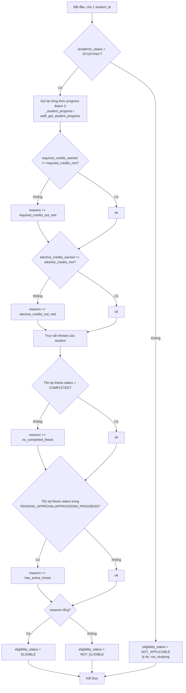
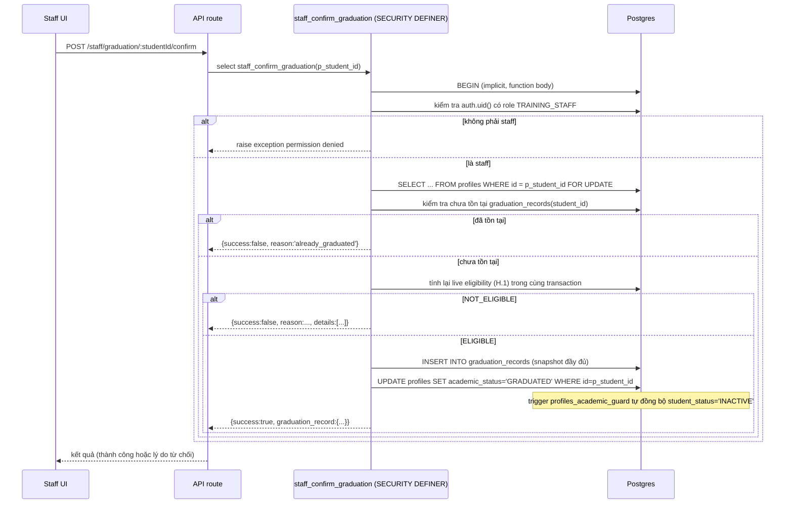
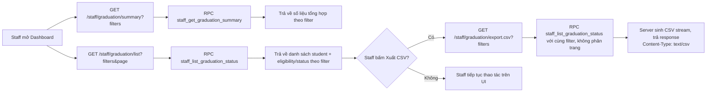

# Batch 5 — Xét tốt nghiệp và Dashboard báo cáo (Design)

Trạng thái: DESIGN ONLY — chưa có migration, chưa có code. Tài liệu này mô tả thiết kế cho Batch 5, tiếp nối:
- `docs/ACADEMIC_MANAGEMENT_EXPANSION_DESIGN.md`
- `docs/BATCH_3_GRADES_AND_PROGRESS_DESIGN.md` (BUS-27..37, UC-22..27)
- `docs/BATCH_4_THESIS_ADVISOR_DESIGN.md` (BUS-38..64, UC-28..42 — **đã chốt** theo tài liệu lịch sử của Batch 4, dù trong repo hiện tại các số hiệu này chỉ xuất hiện rải rác trong comment migration 0028–0038 và trong `docs/BATCH_4_PRE_APPLY_SECURITY_REVIEW.md` chứ không có bảng liệt kê đầy đủ. Đây không phải là mâu thuẫn — chỉ là giới hạn lưu trữ trong repo; số hiệu BUS-38..64/UC-28..42 được coi là đã dùng bởi Batch 4 và không được tái sử dụng.)

**Quyết định numbering (đã chốt, xem mục L.1.1):** Batch 5 tiếp tục đánh số từ **BUS-65** và **UC-43**, kế thừa đúng ranh giới của Batch 4 nêu trên.

Migrations tham chiếu: 0015–0038 (xem mục D, I để biết chi tiết bảng/RPC được tái sử dụng).

---

## A. Mục tiêu / In-scope / Out-of-scope

### Mục tiêu
- Cho phép hệ thống tự động tính "Đủ điều kiện tốt nghiệp" / "Chưa đủ điều kiện" cho từng student dựa trên dữ liệu học tập hiện có (progress + thesis), không cần nhập liệu thêm.
- Cho phép TRAINING_STAFF xác nhận tốt nghiệp cho student đủ điều kiện, tạo một bản ghi bất biến (`graduation_records`) lưu lại toàn bộ căn cứ tại thời điểm xác nhận.
- Đồng bộ `academic_status` → `GRADUATED` khi xác nhận, khóa các hành động tiếp theo (đăng ký học phần, đề xuất luận văn) của student đã tốt nghiệp.
- Cho student tự xem tình trạng tốt nghiệp của bản thân (đủ/chưa đủ, thiếu điều kiện nào).
- Cho staff dashboard tổng hợp + danh sách lọc theo program/cohort/academic_status/eligibility_status, và xuất CSV theo filter hiện tại.

### In-scope
- Tính eligibility "live" (không lưu, tính lại mỗi lần truy vấn) dựa trên progress logic đã có ở Batch 3 và trạng thái thesis ở Batch 4.
- RPC xác nhận tốt nghiệp (staff-only), atomic, tạo `graduation_records`.
- API/UI: student xem own graduation status; staff dashboard/list/detail/confirm; CSV export.
- RLS + ACL hardening theo đúng pattern đã dùng ở Batch 3/4 (revoke PUBLIC/anon, grant authenticated, helper không cấp execute).

### Out-of-scope (KHÔNG làm ở Batch 5)
- GPA / thang điểm hệ 4 (BUS đã chốt: không dùng GPA).
- Quản lý bằng cấp, số hiệu bằng, ngày cấp bằng vật lý.
- Quản lý quyết định hành chính (số quyết định, file quyết định, ký duyệt cấp cao hơn TRAINING_STAFF).
- Upload hồ sơ / tài liệu đính kèm.
- Gửi email/thông báo tốt nghiệp.
- Học phí, công nợ, các điều kiện tài chính.
- Revert/hủy trạng thái GRADUATED (xem mục C).
- Xuất PDF (chỉ CSV).

---

## B. Actor và Permission Matrix

Actor kế thừa từ hệ thống hiện có: `STUDENT`, `TRAINING_STAFF`, `anon` (chưa đăng nhập).

| Hành động | STUDENT (own) | STUDENT (khác) | TRAINING_STAFF | anon |
|---|---|---|---|---|
| Xem eligibility + lý do thiếu của chính mình | ✅ | ❌ | ✅ (mọi student) | ❌ |
| Xem dashboard tổng hợp (số liệu eligible/graduated) | ❌ | ❌ | ✅ | ❌ |
| Xem danh sách student + filter (program/cohort/academic_status/eligibility) | ❌ | ❌ | ✅ | ❌ |
| Xem chi tiết graduation status của 1 student bất kỳ | ❌ | ❌ | ✅ | ❌ |
| Xác nhận tốt nghiệp (tạo `graduation_records`) | ❌ | ❌ | ✅ | ❌ |
| Xem `graduation_records` của chính mình (lịch sử) | ✅ | ❌ | ✅ (mọi student) | ❌ |
| Xuất CSV theo filter | ❌ | ❌ | ✅ | ❌ |
| Sửa/xóa `graduation_records` | ❌ | ❌ | ❌ (không có RPC nào cho phép — bất biến) | ❌ |
| Đăng ký học phần / đề xuất luận văn khi đã GRADUATED | ❌ (bị chặn ở RPC + trigger hiện có, xem mục I) | — | — | ❌ |

Nguyên tắc kế thừa từ Batch 3/4: RLS chỉ kiểm soát SELECT visibility; mọi ghi dữ liệu đi qua RPC `SECURITY DEFINER` tự kiểm tra role bằng `auth.uid()`/`is_training_staff()`.

---

## C. Thuật ngữ

- **Live eligibility (tình trạng đủ điều kiện — tính động)**: kết quả tính toán tại thời điểm truy vấn, dựa trên dữ liệu hiện tại của `profiles`, `program_courses`/progress, và `theses`. Không lưu trữ, không cache. Có thể thay đổi qua lại (VD: nếu progress thay đổi do điểm bị cập nhật, sinh viên có thể chuyển từ "đủ điều kiện" sang "chưa đủ điều kiện" và ngược lại) — cho tới khi bị "đóng băng" bởi một `graduation_records` cho student đó.
- **Immutable graduation record (bản ghi tốt nghiệp — bất biến)**: một dòng trong `graduation_records`, được tạo đúng một lần bởi RPC xác nhận, chụp lại (snapshot) toàn bộ căn cứ đã dùng để xác nhận tại đúng thời điểm đó. Không có RPC UPDATE/DELETE cho bảng này. Đây là nguồn sự thật lịch sử — khác với eligibility live, nó không đổi dù dữ liệu chương trình/tiến độ về sau có thay đổi.
- **Eligibility status (dùng cho filter dashboard)**: một trong `{ELIGIBLE, NOT_ELIGIBLE}` — kết quả tính live eligibility, chỉ áp dụng có ý nghĩa khi `academic_status = STUDYING`. Với student đã `GRADUATED`, `SUSPENDED`, `WITHDRAWN`: eligibility không còn ý nghĩa hành động (không thể xác nhận), dashboard hiển thị riêng theo `academic_status`.
- **Xác nhận tốt nghiệp (confirm)**: hành động staff-only, atomic, chuyển `academic_status` của 1 student từ `STUDYING` → `GRADUATED`, đồng thời tạo 1 dòng `graduation_records`. Không thể thực hiện 2 lần cho cùng 1 student (unique constraint).

---

## D. Data model

### D.1 Bảng mới: `public.graduation_records`

Quan hệ **một-một** với student (`profiles`), append-only/immutable.

| Cột | Kiểu | Ghi chú |
|---|---|---|
| `id` | uuid PK default gen_random_uuid() | |
| `student_id` | uuid NOT NULL, FK → `profiles(id)` | student được xác nhận |
| `confirmed_by` | uuid NOT NULL, FK → `profiles(id)` | staff xác nhận (phải có `role='TRAINING_STAFF'` tại thời điểm ghi, kiểm tra trong RPC) |
| `confirmed_at` | timestamptz NOT NULL default `now()` | thời điểm xác nhận |
| `program_id` | uuid NOT NULL, FK → `programs(id)` | snapshot chương trình tại thời điểm xác nhận (không dùng FK sống để suy luận về sau — xem D.3) |
| `program_code` | text NOT NULL | snapshot `programs.code` (phòng khi program bị đổi code sau này) |
| `program_name` | text NOT NULL | snapshot `programs.name` |
| `cohort_id` | uuid NULL, FK → `cohorts(id)` | snapshot khóa học; nullable vì cohort có thể null trên profile |
| `cohort_code` | text NULL | snapshot `cohorts.code` |
| `required_credits_min` | numeric NOT NULL | ngưỡng chương trình tại thời điểm xác nhận |
| `elective_credits_min` | numeric NOT NULL | ngưỡng chương trình tại thời điểm xác nhận |
| `required_credits_earned` | numeric NOT NULL | tín chỉ bắt buộc đã đạt tại thời điểm xác nhận |
| `elective_credits_earned` | numeric NOT NULL | tín chỉ tự chọn đã đạt tại thời điểm xác nhận |
| `thesis_id` | uuid NOT NULL, FK → `theses(id)` | luận văn COMPLETED dùng để xét (xem D.2 — luôn tồn tại đúng 1 do BUS-41 one-active-thesis + điều kiện completed) |
| `thesis_code` | text NOT NULL | snapshot `theses.thesis_code` |
| `thesis_completed_at` | timestamptz NOT NULL | snapshot `theses.completed_at` (cột mới, xem D.1.1) của thesis đã chọn, tại thời điểm xác nhận tốt nghiệp. **Đã chốt**: KHÔNG dùng `theses.updated_at` làm nguồn cho cột này (xem BUS-79) |
| `eligibility_rules_version` | text NOT NULL | định danh phiên bản bộ quy tắc xét tốt nghiệp đang áp dụng (VD `'v1'`), để giải thích kết quả nếu quy tắc thay đổi sau này |
| `created_at` | timestamptz NOT NULL default `now()` | |

Ràng buộc:
- `UNIQUE (student_id)` — đảm bảo một-một, ngăn xác nhận 2 lần.
- `FOREIGN KEY (student_id) REFERENCES profiles(id)`, không `ON DELETE CASCADE` (không xóa lịch sử tốt nghiệp nếu profile bị xóa — vốn dĩ hệ thống hiện tại cũng không hard-delete profile).
- Không có cột nào cho phép NULL các trường snapshot bắt buộc — nếu RPC không tính được đủ snapshot, phải rollback toàn bộ transaction (không tạo record một phần).
- Index: `idx_graduation_records_student_id` (đã có qua UNIQUE), `idx_graduation_records_program_id`, `idx_graduation_records_confirmed_at` (phục vụ filter/sort dashboard theo thời gian).
- Không có cột UPDATE nào được RPC nào ghi sau khi tạo — bất biến ở tầng thiết kế (không cần trigger chặn UPDATE vì đơn giản là **không viết RPC UPDATE/DELETE nào cho bảng này**; RLS cũng không cấp UPDATE/DELETE cho bất kỳ role nào kể cả staff, xem mục I).

### D.1.1 Bổ sung `theses.completed_at` (đã chốt)

Batch 5 bổ sung một cột mới trên bảng `theses` (đã tạo ở Batch 4, migration 0030) để làm nguồn cho `graduation_records.thesis_completed_at`:

| Cột | Kiểu | Ghi chú |
|---|---|---|
| `theses.completed_at` | timestamptz NULL | Thời điểm luận văn chuyển sang `COMPLETED`. |

Quy tắc (đã chốt, xem BUS-79):
- **Chỉ hệ thống được đặt giá trị này**, và duy nhất tại thời điểm RPC/trigger thực hiện transition `theses.status: IN_PROGRESS → COMPLETED`. Không có API/UI nào cho phép staff/advisor nhập tay giá trị này.
- **Bất biến sau khi đã set**: không RPC nào được UPDATE lại `completed_at` một khi đã khác NULL (kể cả khi các cột khác của `theses` được cập nhật sau đó).
- **KHÔNG dùng `theses.updated_at` làm thời điểm hoàn thành** — `updated_at` có thể bị các cập nhật không liên quan (VD sửa `thesis_code`, sửa advisor) làm trôi giá trị, làm sai lệch căn cứ xét tốt nghiệp.
- Triển khai: sửa RPC hiện có (Batch 4) chịu trách nhiệm chuyển `theses.status` sang `COMPLETED` để đồng thời set `completed_at = now()` trong cùng transaction, có điều kiện `WHERE completed_at IS NULL` để đảm bảo idempotent/không ghi đè nếu vô tình gọi lại (xem migration 0039).

### D.2 Vì sao cần snapshot, không dựa hoàn toàn vào dữ liệu live

- `programs.required_credits_min`/`elective_credits_min` có thể bị staff sửa sau này (không có ràng buộc bất biến trên bảng `programs`). Nếu graduation record chỉ lưu FK tới `program_id` và tính lại ngưỡng live, một sinh viên đã được xác nhận đủ điều kiện theo ngưỡng cũ có thể "trở thành không đủ điều kiện" trong quá khứ khi xem lại lịch sử — sai lệch tính minh bạch/kiểm toán.
- Tương tự, `required_credits_earned`/`elective_credits_earned` được tính động từ `enrollment_grades` (Batch 3) — nếu điểm bị staff sửa/publish lại sau này (dù hiếm), con số tại thời điểm xác nhận vẫn phải được giữ nguyên để giải trình quyết định đã ra.
- `thesis_id`/`thesis_code` được snapshot vì một student có thể có nhiều thesis COMPLETED theo thời gian (thesis cũ COMPLETED, rồi có thesis mới cũng COMPLETED — BUS-41 chỉ giới hạn *active* thesis là 1, không giới hạn số thesis COMPLETED lịch sử); record phải chỉ rõ đã dùng thesis nào để xét. **Đã chốt (BUS-80)**: điều kiện tốt nghiệp chỉ cần **ít nhất một** thesis COMPLETED (không cộng dồn, không yêu cầu tất cả); khi có nhiều hơn một, snapshot chọn đúng một thesis theo thứ tự ưu tiên `completed_at DESC`, tie-break `created_at DESC`. Lý do chọn `completed_at` (không phải `updated_at` hay thứ tự tạo) làm tiêu chí chính: đây là tiêu chí phản ánh đúng ngữ nghĩa nghiệp vụ "luận văn hoàn thành gần đây nhất", ổn định vì bất biến sau khi set (D.1.1), và độc lập với các chỉnh sửa không liên quan tới việc hoàn thành luận văn.
- `eligibility_rules_version` cho phép về sau thay đổi công thức xét tốt nghiệp (VD thêm điều kiện điểm trung bình tối thiểu) mà không làm mất khả năng giải thích các quyết định cũ đã ra theo quy tắc khác.

### D.3 Quan hệ với dữ liệu hiện có

```
profiles (student) --1:0..1--> graduation_records
profiles.program_id --live FK--> programs        (dùng để tính eligibility live)
profiles.cohort_id  --live FK--> cohorts          (dùng để tính eligibility live + filter dashboard)
profiles --(qua _student_grades_rows/_student_progress, Batch 3)--> progress live
profiles --1:N--> theses                          (dùng để tính eligibility live: có COMPLETED? có active?)
graduation_records.program_id/cohort_id/thesis_id --FK "point-in-time reference", không dùng để suy luận trạng thái hiện tại
```

Quan trọng: `graduation_records` giữ FK tới `program_id`/`cohort_id`/`thesis_id` **chỉ để truy vết** (join khi cần xem chi tiết bản ghi gốc), KHÔNG dùng các FK này để tính lại bất cứ số liệu nào hiển thị trong record — mọi số liệu hiển thị phải đọc từ chính các cột snapshot.

### D.4 Không thêm bảng nào khác

Progress/credits tiếp tục dùng nguyên `_student_grades_rows`/`_student_progress` (nội bộ, Batch 3, migration 0025) — Batch 5 KHÔNG viết công thức tính tín chỉ mới, chỉ gọi lại các RPC/helper hiện có (`student_get_own_progress`, `staff_get_student_progress`) hoặc helper nội bộ tương đương để đảm bảo một công thức duy nhất cho toàn hệ thống.

---

## E. Business Rules (tiếp từ BUS-64)

- **BUS-65**: Một student được coi là **đủ điều kiện tốt nghiệp (live eligibility = ELIGIBLE)** khi và chỉ khi đồng thời: (a) `academic_status = 'STUDYING'`; (b) tín chỉ bắt buộc đã đạt (theo công thức Batch 3, `required_credits_earned`) ≥ `programs.required_credits_min` của chương trình đang theo học; (c) tín chỉ tự chọn đã đạt (`elective_credits_earned`) ≥ `programs.elective_credits_min`; (d) có ít nhất một `theses.status = 'COMPLETED'` thuộc về student đó; (e) không có `theses` nào của student đang ở trạng thái active (`PENDING_APPROVAL`, `APPROVED`, `IN_PROGRESS`).
- **BUS-66**: Hệ thống KHÔNG sử dụng GPA/điểm trung bình hệ 4 trong bất kỳ điều kiện xét tốt nghiệp nào ở Batch 5.
- **BUS-67**: Công thức tính `required_credits_earned`/`elective_credits_earned` dùng ở BUS-65 PHẢI là cùng một công thức đã định nghĩa ở Batch 3 (BUS-33..35, migration 0025) — không được định nghĩa lại theo cách khác. Mọi thay đổi công thức tiến độ trong tương lai áp dụng đồng thời cho cả trang Progress và eligibility tốt nghiệp.
- **BUS-68**: Chỉ TRAINING_STAFF mới có quyền xác nhận tốt nghiệp; hệ thống không tự động chuyển `academic_status` sang `GRADUATED`.
- **BUS-69**: RPC xác nhận tốt nghiệp chỉ được thực thi thành công nếu tính lại live eligibility tại đúng thời điểm xác nhận (trong cùng transaction, có khóa dòng) cho ra `ELIGIBLE`; nếu không, RPC trả lỗi nghiệp vụ và không ghi gì.
- **BUS-70**: Sau khi xác nhận, `profiles.academic_status` của student chuyển thành `'GRADUATED'`; theo trigger `profiles_academic_guard` đã có (migration 0018), `student_status` tự động đồng bộ sang `'INACTIVE'` — Batch 5 không viết logic đồng bộ mới, chỉ dựa vào trigger hiện có.
- **BUS-71**: Không có RPC hoặc thao tác UI nào được phép chuyển `academic_status` từ `'GRADUATED'` về trạng thái khác trong phạm vi Batch 5 (không revert).
- **BUS-72**: Một student chỉ có thể có tối đa một `graduation_records` (ràng buộc `UNIQUE(student_id)`); gọi RPC xác nhận lần thứ hai cho cùng student phải thất bại có kiểm soát (trả lỗi nghiệp vụ rõ ràng, không phá vỡ transaction của người khác).
- **BUS-73**: Student có `academic_status = 'GRADUATED'` không được phép tạo enrollment mới (đăng ký học phần). **Đã xác nhận (xem mục L.1.3)**: RPC đăng ký học phần hiện có (legacy, trước Batch 5) kiểm tra điều kiện dựa trên `student_status = 'ACTIVE'`, không trực tiếp trên `academic_status`. Vì `GRADUATED` đã đồng bộ sang `student_status = 'INACTIVE'` theo BUS-70 (qua trigger `profiles_academic_guard` có sẵn), RPC đăng ký hiện có đã tự động chặn student đã tốt nghiệp mà **không cần sửa logic**. Batch 5 không thay đổi rule đăng ký; bắt buộc có test regression xác nhận hành vi chặn này vẫn đúng (xem mục K, test #5).
- **BUS-74**: Student có `academic_status = 'GRADUATED'` không được phép tạo đề xuất luận văn mới — `student_create_thesis_proposal` (migration 0035) phải kiểm tra `academic_status = 'STUDYING'` trước khi cho phép tạo. Khác với BUS-73 (đăng ký học phần, không cần sửa — xem L.1.3), RPC đề xuất luận văn hiện tại không tự chặn qua `student_status`, nên vẫn cần bổ sung điều kiện này ở migration 0047.
- **BUS-75**: Student đã `GRADUATED` vẫn được xem đầy đủ lịch sử: điểm (`student_get_own_grades`), tiến độ (`student_get_own_progress`), luận văn (theses của mình), và graduation record của chính mình — không bị RLS chặn SELECT chỉ vì đã tốt nghiệp.
- **BUS-76**: Dashboard/list/CSV cho staff chỉ hiển thị dữ liệu tổng hợp trên toàn bộ student — không có RLS nào cho phép một student thấy dữ liệu graduation của student khác (kể cả gián tiếp qua API); mọi endpoint dashboard/CSV bắt buộc `TRAINING_STAFF`.
- **BUS-77**: CSV export phải phản ánh đúng filter hiện tại của dashboard tại thời điểm gọi (program/cohort/academic_status/eligibility_status) — không có tùy chọn export toàn bộ bỏ qua filter, và không lưu file phía server (trả trực tiếp qua response). **Đã chốt**: chỉ `TRAINING_STAFF` được export (không role nào khác); không có xuất PDF ở Batch 5 (chỉ CSV); danh sách cột chính xác xem mục J.
- **BUS-78**: Mọi RPC mới của Batch 5 phải được revoke khỏi `PUBLIC`/`anon` và chỉ grant `EXECUTE` cho `authenticated`, theo đúng pattern ACL sweep đã dùng ở migration 0020/0038; helper nội bộ (nếu có, VD `_compute_graduation_eligibility`) không được cấp EXECUTE cho bất kỳ role ứng dụng nào.
- **BUS-79** (đã chốt): `theses.completed_at` chỉ được hệ thống ghi đúng một lần, tại thời điểm RPC/trigger chuyển `theses.status` từ `IN_PROGRESS` sang `COMPLETED` (xem D.1.1). Giá trị này bất biến sau khi đã set — không RPC nào được phép UPDATE lại. Hệ thống KHÔNG dùng `theses.updated_at` làm thời điểm hoàn thành luận văn cho bất kỳ mục đích nào liên quan tới xét/xác nhận tốt nghiệp.
- **BUS-80** (đã chốt): Điều kiện tốt nghiệp về luận văn (BUS-65.d) chỉ yêu cầu **ít nhất một** `theses.status = 'COMPLETED'`. Khi một student có nhiều hơn một thesis COMPLETED trong lịch sử, `graduation_records` snapshot đúng một thesis, chọn theo `completed_at` giảm dần (gần nhất trước); nếu bằng nhau, tie-break theo `created_at` giảm dần. Xem D.2 để biết lý do chọn tiêu chí này.
- **BUS-81** (đã chốt): `staff_list_graduation_status` (và mọi endpoint danh sách staff khác của Batch 5) áp dụng phân trang với `page_size` mặc định **20**, tối đa **100**; request với `page_size` vượt quá 100 bị từ chối ở tầng validate (Zod), không âm thầm cắt xuống 100.

---

## F. Use cases (tiếp sau UC-42)

- **UC-43** — *Student xem tình trạng tốt nghiệp của chính mình*. Actor: Student. Student vào trang "Tốt nghiệp", hệ thống hiển thị `ELIGIBLE`/`NOT_ELIGIBLE` (nếu chưa GRADUATED) hoặc thông tin graduation record (nếu đã GRADUATED), kèm danh sách điều kiện đạt/chưa đạt theo BUS-65.
- **UC-44** — *Staff xem dashboard tổng hợp tốt nghiệp*. Actor: TRAINING_STAFF. Staff vào dashboard, thấy số liệu tổng hợp (tổng student STUDYING, số ELIGIBLE, số NOT_ELIGIBLE, số GRADUATED) theo filter mặc định hoặc đã áp dụng.
- **UC-45** — *Staff lọc danh sách student theo program/cohort/academic_status/eligibility_status*. Actor: TRAINING_STAFF. Staff áp dụng 1 hoặc nhiều filter, danh sách và số liệu tổng hợp cập nhật theo.
- **UC-46** — *Staff xem chi tiết điều kiện tốt nghiệp của 1 student*. Actor: TRAINING_STAFF. Staff bấm vào 1 dòng trong danh sách, xem chi tiết từng điều kiện BUS-65 (đạt/chưa đạt, số liệu cụ thể).
- **UC-47** — *Staff xác nhận tốt nghiệp cho 1 student đủ điều kiện*. Actor: TRAINING_STAFF, System. Staff bấm "Xác nhận tốt nghiệp" trên student đang `ELIGIBLE`; hệ thống tính lại eligibility trong transaction, nếu vẫn đạt thì tạo `graduation_records` và chuyển `academic_status`; nếu không còn đạt (do dữ liệu vừa đổi), từ chối và báo lý do.
- **UC-48** — *Staff cố xác nhận tốt nghiệp cho student chưa đủ điều kiện hoặc đã tốt nghiệp*. Actor: TRAINING_STAFF, System. Hệ thống từ chối có kiểm soát, không đổi trạng thái, hiển thị lý do (thiếu điều kiện gì, hoặc đã có graduation record).
- **UC-49** — *Staff xuất CSV danh sách theo filter hiện tại*. Actor: TRAINING_STAFF. Staff bấm "Xuất CSV" trên dashboard đang áp filter X, nhận file CSV chỉ chứa các dòng khớp filter X.
- **UC-50** — *Student cố truy cập dữ liệu tốt nghiệp của student khác hoặc dashboard staff*. Actor: Student, System. Hệ thống từ chối (403/RLS rỗng), không lộ dữ liệu.

---

## G. User stories + Gherkin

### US-1: Student xem tình trạng tốt nghiệp

```gherkin
Feature: Student xem tình trạng tốt nghiệp của chính mình

  Scenario: Student đủ điều kiện xem trạng thái ELIGIBLE
    Given student "S1" có academic_status "STUDYING"
    And student "S1" đã đạt đủ tín chỉ bắt buộc và tự chọn theo chương trình
    And student "S1" có một thesis "COMPLETED" và không có thesis active
    When student "S1" gọi student_get_own_graduation_status
    Then kết quả trả về eligibility_status = "ELIGIBLE"
    And danh sách reasons rỗng

  Scenario: Student chưa đủ điều kiện thấy rõ lý do còn thiếu
    Given student "S2" có academic_status "STUDYING"
    And student "S2" chưa đạt đủ tín chỉ tự chọn
    And student "S2" chưa có thesis "COMPLETED" nào
    When student "S2" gọi student_get_own_graduation_status
    Then kết quả trả về eligibility_status = "NOT_ELIGIBLE"
    And reasons chứa "elective_credits_not_met"
    And reasons chứa "no_completed_thesis"

  Scenario: Student đã tốt nghiệp xem lại graduation record của mình
    Given student "S3" đã có graduation_records
    When student "S3" gọi student_get_own_graduation_status
    Then kết quả trả về graduation_record với các trường snapshot đã lưu
```

### US-2: Staff xác nhận tốt nghiệp

```gherkin
Feature: Staff xác nhận tốt nghiệp

  Scenario: Xác nhận thành công cho student đủ điều kiện
    Given staff đăng nhập với role TRAINING_STAFF
    And student "S1" đang ELIGIBLE và chưa có graduation_records
    When staff gọi staff_confirm_graduation(S1)
    Then RPC trả success = true
    And profiles.academic_status của S1 chuyển thành "GRADUATED"
    And profiles.student_status của S1 tự động thành "INACTIVE"
    And một dòng graduation_records mới được tạo cho S1 với đầy đủ snapshot

  Scenario: Từ chối xác nhận khi student không còn đủ điều kiện tại thời điểm xác nhận
    Given student "S2" hiển thị ELIGIBLE trên dashboard lúc staff mở trang
    And ngay trước khi staff bấm xác nhận, thesis COMPLETED duy nhất của S2 bị hủy qua một luồng khác dẫn tới không còn thesis COMPLETED nào
    When staff gọi staff_confirm_graduation(S2)
    Then RPC trả success = false với lý do cụ thể
    And profiles.academic_status của S2 không đổi
    And không có dòng graduation_records nào được tạo

  Scenario: Từ chối xác nhận lần hai cho cùng một student
    Given student "S1" đã có graduation_records
    When staff gọi staff_confirm_graduation(S1) lần nữa
    Then RPC trả success = false với lý do "already_graduated"
    And không có dòng graduation_records thứ hai nào được tạo

  Scenario: Student không phải TRAINING_STAFF không thể gọi RPC xác nhận
    Given người dùng đăng nhập với role STUDENT
    When người dùng gọi staff_confirm_graduation(bất kỳ student nào)
    Then RPC từ chối với lỗi permission
```

### US-3: Staff dashboard, filter, CSV

```gherkin
Feature: Staff dashboard và xuất CSV

  Scenario: Staff xem số liệu tổng hợp
    Given có N student STUDYING, trong đó E là ELIGIBLE và G student đã GRADUATED
    When staff mở dashboard tốt nghiệp
    Then dashboard hiển thị đúng số N, E, N-E, G

  Scenario: Staff lọc theo program và eligibility_status
    Given nhiều student thuộc nhiều program khác nhau
    When staff áp filter program = "CNTT" và eligibility_status = "ELIGIBLE"
    Then danh sách chỉ hiển thị student thuộc "CNTT" và đang ELIGIBLE
    And số liệu tổng hợp cập nhật theo đúng tập đã lọc

  Scenario: Staff xuất CSV theo filter hiện tại
    Given staff đang áp filter cohort = "K2021"
    When staff bấm "Xuất CSV"
    Then file CSV trả về chỉ chứa các student thuộc cohort "K2021"
    And không chứa student thuộc cohort khác

  Scenario: Anon không truy cập được dashboard hay CSV
    Given người dùng chưa đăng nhập
    When người dùng gọi endpoint dashboard hoặc CSV export
    Then hệ thống từ chối truy cập
```

---

## H. Mermaid flows

### H.1 Tính live eligibility



### H.2 Staff xác nhận tốt nghiệp (atomic)



### H.3 Dashboard / filter / CSV



---

## I. Migration plan (bắt đầu từ 0039 — KHÔNG viết SQL trong tài liệu này)

| # | Nội dung dự kiến |
|---|---|
| 0039 | Thêm cột `theses.completed_at timestamptz NULL` (xem D.1.1, BUS-79). Sửa RPC hiện có (Batch 4) chịu trách nhiệm chuyển `theses.status → COMPLETED` để set `completed_at = now() WHERE completed_at IS NULL` trong cùng transaction. Không thêm RPC UPDATE nào khác được phép ghi cột này. |
| 0040 | Schema: tạo bảng `graduation_records` như mục D.1, các FK, `UNIQUE(student_id)`, các index mục D.1. Không có cột nào cho phép cập nhật sau khi ghi. |
| 0041 | RLS cho `graduation_records`: SELECT cho staff (mọi dòng), SELECT cho student (chỉ dòng có `student_id = auth.uid()`); KHÔNG có policy INSERT/UPDATE/DELETE cho bất kỳ role ứng dụng nào (mọi ghi dữ liệu chỉ qua RPC `SECURITY DEFINER`, chạy với quyền definer không bị RLS chặn khi ghi nội bộ nhưng bản thân RPC tự kiểm tra role trước khi ghi). |
| 0042 | RPC nội bộ (không expose) tính eligibility: helper dùng lại `_student_progress`/`_student_grades_rows` (Batch 3) + truy vấn `theses`, trả về cấu trúc chuẩn `{eligibility_status, reasons[], required_credits_earned, elective_credits_earned, ...}`; bao gồm logic chọn thesis COMPLETED để snapshot theo BUS-80 (`completed_at DESC, created_at DESC`) khi cần trả `thesis_id` cho việc xác nhận. Cân nhắc đặt tên `_compute_graduation_eligibility(p_student_id)`. |
| 0043 | RPC `student_get_own_graduation_status()`: dùng helper 0042 cho `auth.uid()`, hoặc trả graduation_record nếu đã tồn tại. |
| 0044 | RPC `staff_get_student_graduation_status(p_student_id)`: tương đương bản staff-only cho 1 student bất kỳ (dùng cho UC-46). |
| 0045 | RPC `staff_confirm_graduation(p_student_id)`: theo đúng luồng H.2 — khóa dòng profile bằng `FOR UPDATE`, kiểm tra chưa có graduation_records, tính lại eligibility trong transaction (dùng helper 0042 để chọn đúng thesis theo BUS-80), INSERT graduation_records (snapshot `thesis_completed_at = theses.completed_at` của thesis đã chọn) + UPDATE academic_status atomic, trả `{success, reason?, graduation_record?}`. |
| 0046 | RPC `staff_get_graduation_summary(filters)` và `staff_list_graduation_status(filters, pagination)`: tổng hợp + danh sách có filter theo `program_id`, `cohort_id`, `academic_status`, `eligibility_status` (tính live qua helper 0042 cho từng dòng, hoặc qua view SQL nội bộ nếu cần tối ưu — không lưu bảng vật lý). `staff_list_graduation_status` nhận `page`/`page_size`, validate `page_size` mặc định 20, tối đa 100 (BUS-81), từ chối nếu vượt quá. |
| 0047 | Bổ sung điều kiện `academic_status = 'STUDYING'` vào `student_create_thesis_proposal` (migration 0035) để enforce BUS-74. **Đã chốt (xem L.1.3)**: RPC đăng ký học phần hiện có KHÔNG cần sửa — đã tự chặn student GRADUATED thông qua `student_status='INACTIVE'` (đồng bộ tự động theo BUS-70); migration này chỉ còn phạm vi RPC đề xuất luận văn. |
| 0048 | ACL sweep cuối batch (theo đúng mẫu 0020/0038): `revoke all on function ... from public, anon; grant execute ... to authenticated;` cho toàn bộ RPC mới 0039, 0042–0047 (trừ helper `_compute_graduation_eligibility` — không grant cho bất kỳ ai). |
| 0049 | **Hardening bổ sung (2026-08-04, xem addendum ngay dưới)** — sửa lỗ hổng P1 tìm thấy ở `docs/BATCH_5_PRE_APPLY_SECURITY_REVIEW.md` Finding #1: `staff_update_student` (Batch 2, migration 0019) cho phép set trực tiếp `academic_status='GRADUATED'` (bỏ qua eligibility/snapshot) và cho phép revert một student đã GRADUATED. |

Ghi chú xuyên suốt migration plan: RPC 0045 (`staff_confirm_graduation`) là nơi duy nhất ghi vào `graduation_records`/chuyển `academic_status`; phải dùng `SELECT ... FOR UPDATE` trên dòng `profiles` của student mục tiêu để loại race hai staff cùng xác nhận đồng thời, và phải recompute eligibility ngay trong transaction đó (không tin vào giá trị dashboard đã cache ở phía client).

---

## Addendum (2026-08-04) — Migration 0049: graduation status transition hardening

**Bối cảnh:** `docs/BATCH_5_PRE_APPLY_SECURITY_REVIEW.md` Finding #1 (P1) phát
hiện `staff_update_student` (0019, Batch 2, chưa từng được Batch 5 sửa) cho
phép TRAINING_STAFF (a) set `academic_status='GRADUATED'` trực tiếp mà không
qua `staff_confirm_graduation`/eligibility, và (b) revert một student đã
GRADUATED về bất kỳ trạng thái nào khác qua UI `StaffStudentDetail.tsx` đang
hoạt động thật. Cả hai vi phạm BUS-71.

**Invariant mới bổ sung ở migration `0049_harden_graduation_status_transition.sql`:**

1. **DB trigger backstop** (`profiles_graduation_status_guard`, `BEFORE
   INSERT OR UPDATE` trên `public.profiles`, trigger tên
   `profiles_academic_00_graduation_guard` để chạy TRƯỚC
   `profiles_academic_guard` (0018) theo thứ tự alphabet tên trigger):
   - Chặn `OLD.academic_status = 'GRADUATED' AND NEW.academic_status <> 'GRADUATED'`
     (revert).
   - Chặn `NEW.academic_status = 'GRADUATED' AND OLD.academic_status <> 'GRADUATED'`
     khi chưa tồn tại dòng `graduation_records` tương ứng (set trực tiếp,
     bỏ qua eligibility).
   - Đây là lớp phòng thủ độc lập với RPC — vẫn có hiệu lực kể cả nếu một
     RPC/thao tác tương lai quên kiểm tra, hoặc một write dùng
     `service_role`.
2. **`staff_update_student` (0019) được `CREATE OR REPLACE` trong 0049**,
   giữ nguyên chữ ký, thêm 2 kiểm tra business-rule trả về
   `{success:false, reason}` (không raise exception, đúng convention hiện
   có): từ chối `p_academic_status='GRADUATED'`, và từ chối bất kỳ update
   nào khi student hiện tại đã `academic_status='GRADUATED'`.
3. **Thứ tự operations trong `staff_confirm_graduation` (0045) đã đúng sẵn**
   (INSERT `graduation_records` dòng 63-78, UPDATE `academic_status` dòng
   82, cùng transaction) — không cần sửa, xác nhận qua đọc lại migration.
4. UI `StaffStudentDetail.tsx`: bỏ option GRADUATED khỏi dropdown trạng
   thái; nếu student hiện tại đã GRADUATED, hiển thị badge readonly thay
   form, disable nút submit, và ghi chú xác nhận tốt nghiệp phải qua trang
   Graduation Dashboard.

**Giới hạn:** đây là fix + kiểm tra tĩnh/local (typecheck, lint, build,
unit test cho Zod schema) — KHÔNG chứng minh hành vi trigger/RLS/concurrency
thật trên Postgres. Xem
`supabase/tests/0049_harden_graduation_status_transition.test-plan.sql`
(đặt ngoài `supabase/migrations/` để không bị Supabase CLI tự động apply)
cho các case cần chạy trong transaction test phase trước khi coi P1 là đã
verify runtime.

---

## J. API / UI

Theo đúng convention hiện có (`apps/api/src/routes/*.ts` + Zod schema, `apps/web/src/pages/**` + `apps/web/src/lib/api.ts` + `LoadState`).

### API routes (dự kiến)
- `GET /student/graduation` → `student_get_own_graduation_status`
- `GET /staff/graduation/summary` (query: `program_id?`, `cohort_id?`, `academic_status?`, `eligibility_status?`) → `staff_get_graduation_summary`
- `GET /staff/graduation/students` (cùng query + `page`, `page_size` — mặc định `page_size=20`, tối đa `page_size=100`, đã chốt BUS-81) → `staff_list_graduation_status`
- `GET /staff/graduation/students/:studentId` → `staff_get_student_graduation_status`
- `POST /staff/graduation/students/:studentId/confirm` → `staff_confirm_graduation`
- `GET /staff/graduation/export.csv` (cùng query filter, không phân trang — luôn xuất toàn bộ tập khớp filter hiện tại) → chỉ `TRAINING_STAFF`, gọi `staff_list_graduation_status` không giới hạn trang, stream CSV. **Cột CSV (đã chốt, thứ tự cố định)**: `mã học viên, họ tên, chương trình, khóa, academic status, eligibility status, tín chỉ bắt buộc đạt, tín chỉ tự chọn đạt, luận văn hoàn thành, điều kiện còn thiếu`. Không có xuất PDF ở Batch 5.

### UI (dự kiến)
- `apps/web/src/pages/student/StudentGraduation.tsx`: theo mẫu `StudentGrades.tsx` — `LoadState` loading/ready/error, hiển thị badge ELIGIBLE/NOT_ELIGIBLE/GRADUATED, danh sách lý do thiếu nếu NOT_ELIGIBLE, thông tin graduation record nếu đã GRADUATED. Empty state không áp dụng (luôn có kết quả tính được).
- `apps/web/src/pages/staff/StaffGraduationDashboard.tsx`: số liệu tổng hợp (stat tiles) + bảng filter (program/cohort/academic_status/eligibility_status) + nút "Xuất CSV" (trigger tải file qua endpoint export, giữ nguyên filter hiện tại). Loading/error/empty (0 kết quả khớp filter) theo đúng convention `.banner.banner-error` + nút "Thử lại".
- `apps/web/src/pages/staff/StaffStudentGraduationDetail.tsx` (hoặc tab trong `StaffStudentDetail.tsx` hiện có): chi tiết điều kiện + nút "Xác nhận tốt nghiệp" (chỉ hiển thị khi `eligibility_status = ELIGIBLE` và chưa có graduation record; disabled + tooltip lý do khi không đủ điều kiện). Sau khi xác nhận thành công, UI cập nhật lại trạng thái, KHÔNG hiển thị bất kỳ nút revert/hủy nào (theo BUS-71).
- Không có UI nào cho phép sửa/xóa graduation record.

---

## K. Test plan

1. **Từng điều kiện đủ/thiếu (BUS-65)**: test riêng từng nhánh — thiếu required credits, thiếu elective credits, không có thesis COMPLETED, có thesis active (từng trạng thái PENDING_APPROVAL/APPROVED/IN_PROGRESS), academic_status khác STUDYING (SUSPENDED/GRADUATED/WITHDRAWN), và trường hợp đủ tất cả → ELIGIBLE. Test tổ hợp thiếu nhiều điều kiện cùng lúc → reasons chứa đủ tất cả.
2. **RLS**: student chỉ SELECT được graduation_record/eligibility của chính mình; staff SELECT được mọi dòng; anon bị từ chối tất cả endpoint; student gọi trực tiếp RPC staff-only (`staff_confirm_graduation`, `staff_list_graduation_status`, ...) phải bị từ chối ở tầng RPC (không chỉ ở API layer).
3. **Confirm hai lần / concurrency**: gọi `staff_confirm_graduation` hai lần liên tiếp cho cùng student → lần hai thất bại với lý do `already_graduated`, không có 2 dòng graduation_records. Test hai request đồng thời (race) cho cùng student — dùng `FOR UPDATE` để đảm bảo chỉ một request thành công, request còn lại thất bại có kiểm soát (không deadlock, không tạo 2 record).
4. **Snapshot không đổi khi program config đổi sau confirm**: xác nhận tốt nghiệp cho 1 student, sau đó staff sửa `programs.required_credits_min`; đọc lại graduation_record của student đó → các trường snapshot (`required_credits_min`, `required_credits_earned`, ...) giữ nguyên giá trị tại thời điểm xác nhận, không đổi theo config mới.
5. **Registration regression — graduated student bị chặn đăng ký học phần (bắt buộc, BUS-73)**: sau khi một student được xác nhận GRADUATED (→ `student_status` tự đồng bộ `INACTIVE`), gọi RPC đăng ký học phần hiện có (legacy, không sửa ở Batch 5) → phải bị từ chối, xác nhận rõ lý do là do `student_status != 'ACTIVE'` (không phải lỗi khác); test này bảo vệ việc không cần sửa RPC đăng ký (xem BUS-73, L.1.3) — nếu test fail nghĩa là giả định sai và phải xử lý lại migration 0047.
6. **Thesis proposal bị chặn khi GRADUATED (BUS-74)**: sau khi GRADUATED, gọi `student_create_thesis_proposal` → từ chối có kiểm soát, do kiểm tra `academic_status = 'STUDYING'` mới thêm ở migration 0047.
7. **CSV filters/data isolation + đúng cột (đã chốt)**: xuất CSV với các filter khác nhau (program, cohort, academic_status, eligibility_status, kết hợp nhiều filter) → nội dung file chỉ chứa đúng tập dòng khớp filter, không rò rỉ dòng ngoài filter; xác nhận số dòng CSV khớp với số liệu tổng hợp dashboard cùng filter; xác nhận đúng thứ tự và tên 10 cột đã chốt ở mục J; xác nhận STUDENT gọi endpoint export bị từ chối (chỉ TRAINING_STAFF).
8. **Pagination (BUS-81)**: gọi `staff_list_graduation_status` không truyền `page_size` → mặc định 20; truyền `page_size=100` → thành công; truyền `page_size=101` → bị từ chối ở tầng validate.
9. **`theses.completed_at` bất biến (BUS-79)**: sau khi thesis chuyển COMPLETED và `completed_at` được set, thực hiện một update khác lên thesis đó (không liên quan status) → `completed_at` không đổi; xác nhận không có RPC nào trong hệ thống có thể UPDATE lại cột này.
10. **Chọn đúng thesis khi có nhiều COMPLETED (BUS-80, determinism)**: tạo cho 1 student ≥2 thesis đều COMPLETED với `completed_at` khác nhau → xác nhận tốt nghiệp snapshot đúng thesis có `completed_at` lớn nhất; test riêng trường hợp `completed_at` trùng nhau → snapshot đúng thesis có `created_at` lớn nhất (tie-break); chạy lại nhiều lần để xác nhận kết quả deterministic (không random).
11. **ACL hardening**: xác nhận mọi RPC mới (0039, 0042–0047) bị revoke khỏi `PUBLIC` và `anon`, chỉ `authenticated` có EXECUTE; helper nội bộ (`_compute_graduation_eligibility`) không có EXECUTE cho bất kỳ role ứng dụng nào — theo đúng mẫu kiểm tra đã dùng ở `docs/BATCH_4_PRE_APPLY_SECURITY_REVIEW.md`.
12. **Regression Batch 1–4**: chạy lại bộ test hiện có của đăng ký học phần, điểm/tiến độ (Batch 3), luận văn/advisor (Batch 4) sau khi thêm cột `theses.completed_at` (migration 0039) và điều kiện `academic_status` mới vào `student_create_thesis_proposal` (migration 0047) — đảm bảo student STUDYING bình thường không bị ảnh hưởng.

---

## L. Decision Log / Assumptions / Open Decisions

### L.1 Quyết định đã chốt (2026-08-04)

Các điểm sau đây trước đó là "open decision" trong bản thiết kế trước, nay đã được người có thẩm quyền chốt và áp dụng xuyên suốt tài liệu:

1. **Numbering**: Batch 5 tiếp tục đánh số từ **BUS-65** và **UC-43**. Batch 4 được coi là đã chốt phạm vi **BUS-38..64 / UC-28..42** theo tài liệu lịch sử của batch đó (`docs/BATCH_4_THESIS_ADVISOR_DESIGN.md`), dù trong repo hiện tại các số hiệu này chỉ còn tham chiếu rải rác trong comment migration 0028–0038 và `docs/BATCH_4_PRE_APPLY_SECURITY_REVIEW.md` chứ không có bảng liệt kê đầy đủ còn lưu lại. Không coi đây là xung đột hay khoảng trống cần lấp — số hiệu BUS-38..64/UC-28..42 không được tái sử dụng bởi Batch 5 hay bất kỳ batch nào khác.
2. **`theses.completed_at`**: bổ sung cột mới trên `theses` (migration 0039). Chỉ hệ thống đặt giá trị, duy nhất tại thời điểm transition `IN_PROGRESS → COMPLETED`; bất biến sau đó; KHÔNG dùng `updated_at` làm thời điểm hoàn thành (BUS-79, D.1.1). `graduation_records.thesis_completed_at` snapshot đúng cột này.
3. **Registration regression**: đã xác nhận logic RPC đăng ký học phần hiện có (legacy) dựa trên `student_status = 'ACTIVE'`. Vì GRADUATED đồng bộ sang `student_status = 'INACTIVE'` (BUS-70, trigger có sẵn), **không cần sửa rule đăng ký** ở Batch 5. Bắt buộc có test regression xác nhận graduated student bị chặn đăng ký học phần (mục K, test #5) trước khi coi migration 0047 là hoàn tất.
4. **CSV export**: cột theo đúng thứ tự — mã học viên, họ tên, chương trình, khóa, academic status, eligibility status, tín chỉ bắt buộc đạt, tín chỉ tự chọn đạt, luận văn hoàn thành, điều kiện còn thiếu. Chỉ `TRAINING_STAFF` được export; luôn theo filter hiện tại của dashboard tại thời điểm gọi; không có xuất PDF ở Batch 5 (mục J, BUS-77).
5. **Pagination**: `staff_list_graduation_status` (và các endpoint danh sách staff khác của Batch 5) mặc định `page_size = 20`, tối đa `page_size = 100` (BUS-81, mục J/I).
6. **Nhiều thesis COMPLETED**: điều kiện tốt nghiệp chỉ cần ít nhất một thesis COMPLETED (không đổi so với thiết kế trước). Khi có nhiều hơn một, snapshot chọn thesis COMPLETED gần nhất theo `completed_at DESC`, tie-break `created_at DESC` (BUS-80, D.2). Quyết định này đảm bảo tính xác định (deterministic) — cùng một trạng thái dữ liệu luôn cho ra cùng một kết quả snapshot, kể cả khi RPC xác nhận được gọi lại nhiều lần trong môi trường test hoặc khi review lại bằng tay; đây là lý do bắt buộc có test determinism riêng (mục K, test #10).

### L.2 Còn mở (không chặn bắt đầu implement)

1. **`eligibility_rules_version` giá trị khởi tạo và cơ chế cập nhật** — tài liệu này đề xuất một chuỗi tĩnh `'v1'` cho migration 0040; ai là người cập nhật giá trị này khi công thức eligibility thay đổi trong tương lai (thủ công trong migration mới, hay có bảng cấu hình riêng — hiện chưa có bảng cấu hình như vậy, không tự thêm ngoài scope) vẫn cần chốt, nhưng không ảnh hưởng tới việc bắt đầu viết migration 0039 vì `'v1'` là giá trị an toàn để khởi tạo.

---

## Verdict

**READY FOR BATCH 5 IMPLEMENTATION** — toàn bộ 6 điểm từng "mở" (numbering, `theses.completed_at`, registration regression, cột CSV, pagination, quy tắc chọn thesis khi có nhiều COMPLETED) đã được chốt và đồng bộ vào data model, business rules, use case/Gherkin, Mermaid, migration plan, API/UI, và test plan ở trên. Điểm còn lại ở mục L.2 (`eligibility_rules_version`) không phải blocker — có thể bắt đầu migration 0039 với giá trị khởi tạo tĩnh `'v1'` và chốt cơ chế cập nhật sau, trước khi Batch 5 có thay đổi công thức eligibility đầu tiên.
